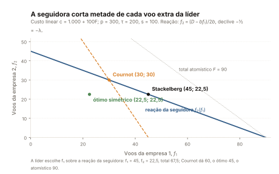
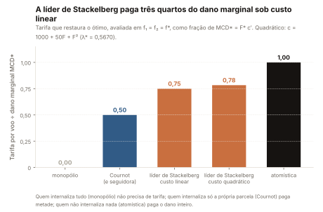

# Teoria dos jogos: os fundamentos de que o modelo precisa

Português (ADR-0006).

Este capítulo ensina, do zero e só com exemplos de empresas aéreas, as
ferramentas que o capítulo 3
([03-o-jogo-do-congestionamento.md](03-o-jogo-do-congestionamento.md)) usa
para derivar o modelo do líder de Stackelberg — e nenhuma a mais. Quem o lê
sai sabendo o que é um jogo e como se descreve um; o que são resposta ótima,
estratégia dominante e equilíbrio de Nash, num jogo de duas jogadas em que
duas empresas decidem se acrescentam um voo ao pico de um aeroporto cheio;
como a mesma lógica vira uma função de reação quando os voos são
quantidades; o que muda quando uma empresa escolhe antes da outra; o que
"internalizar uma externalidade" significa em termos de jogo; por que o
planejador social é a referência cooperativa e a tarifa pigouviana é o
mecanismo que alinha o privado ao social; e por que a internalização se
ordena pela estrutura de mercado — monopólio, Cournot, líder de Stackelberg,
atomismo. Cada seção segue a mesma ordem: a definição antes do símbolo, a
intuição antes da álgebra, um exemplo numérico depois de cada resultado, e
uma frase sobre o que aquilo significa para Bendinelli, Bettini & Oliveira
(2016, *Transportation Research Part A* 85, 39-52, doi
10.1016/j.tra.2016.01.001), daqui em diante "o artigo".

A notação é a do capítulo 3, para que o leitor chegue lá fluente. Todo
número deste capítulo sai de `reports/theory/model.json`: o exemplo contínuo
é o bloco `examples.linear`, e o jogo de duas jogadas é o bloco `primer`,
que `src/airline_delays/theory/primer.py` recorta do mesmo exemplo linear —
os dois contam a mesma história com os mesmos parâmetros. As definições
padrão de jogo, equilíbrio de Nash, Cournot e Stackelberg são as de qualquer
curso de estratégia, por exemplo Besanko et al. (2012); a aplicação ao
congestionamento é a de Brueckner (2002) e Brueckner e Van Dender (2008).

| símbolo | nome em `src/airline_delays/theory/model.py` | o que é |
|---|---|---|
| $`f_1`$, $`f_2`$ | `f1`, `f2` | voos da empresa 1 (líder, quando há ordem) e da empresa 2 (seguidora) |
| $`F = f_1 + f_2`$ | `F` | tráfego total no pico |
| $`p`$ | `p` | preço total pago pelo passageiro; demanda perfeitamente elástica no caso básico |
| $`\tau`$ | `tau` | custo por assento sem congestionamento |
| $`s`$ | `s` | assentos por aeronave, todos vendidos |
| $`c(F)`$, $`c'`$, $`c''`$ | `c0`, `c1`, `c2` | custo de congestionamento por voo e suas derivadas, $`c' > 0`$, $`c'' \ge 0`$ |
| $`\pi_i`$ | — | lucro da empresa $`i`$ |
| $`\lambda = -\partial f_2/\partial f_1`$ | `lam` | quantos voos a seguidora corta por voo extra da líder |
| $`\mathrm{MCD} = F\,c'(F)`$ | `tolls.MCD` em `model.json` | dano marginal de congestionamento: o custo que um voo a mais impõe a todos os voos |
| $`T_1`$, $`T_2`$ | — | tarifas por voo que levam cada empresa ao ótimo |
| $`F^{*}`$, $`f^{*}`$ | — | tráfego eficiente e o volume eficiente por empresa, $`F^{*}/2`$ |
| $`D = (p - \tau)\,s - a`$ | `D` em `linear_closed_forms` | receita líquida por voo, descontada a parte fixa do custo de congestionamento, no caso linear $`c(F) = a + b\,F`$ |

## 1. O que é um jogo

Um jogo é uma situação em que o resultado de cada um depende das escolhas de
todos. Descrevê-lo exige cinco peças: quem joga (os **jogadores**); o que
cada um pode escolher (as **estratégias**); o que cada um recebe em cada
combinação de escolhas (os **payoffs**, ou ganhos); quem escolhe quando (a
**ordem dos lances**); e o que cada um sabe na hora de escolher (a
**informação**). Um mercado com poucas empresas é um jogo porque o lucro de
cada uma depende do que as outras fazem. É isso que separa o oligopólio da
concorrência perfeita, em que ninguém é grande o bastante para afetar os
demais.

No aeroporto congestionado o jogo é este. Os jogadores são duas empresas
aéreas, 1 e 2. A estratégia de cada uma é quantos voos programar no pico,
$`f_1`$ e $`f_2`$; o tráfego total é $`F = f_1 + f_2`$. O payoff é o lucro,
$`\pi_1`$ e $`\pi_2`$. A ordem varia com a seção: nas seções 2 e 3 as duas
escolhem ao mesmo tempo; na seção 4 uma escolhe antes e a outra observa e
responde. A informação é completa: cada empresa conhece a demanda, os custos
e a regra do jogo, e sabe que a rival também os conhece.

O que liga os jogadores é o custo. Cada voo rende $`(p - \tau)\,s`$ antes do
congestionamento — o preço total $`p`$ pago pelo passageiro menos o custo
$`\tau`$ de um assento, vezes os $`s`$ assentos, todos vendidos — e custa
$`c(F)`$ de congestionamento, com $`c' > 0`$. O custo de um voo **meu**
depende de quantos voos **você** programa; essa dependência é a
externalidade do capítulo 1, agora dentro da função-lucro. O lucro da
empresa $`i`$ é

```math
\pi_i = (p - \tau)\, s\, f_i - c(F)\, f_i, \qquad F = f_1 + f_2 \tag{2.1}
```

e o capítulo 3 a escreve duas vezes, como as equações (3) e (4), uma para
cada empresa. O exemplo que percorre o capítulo fixa os primitivos abaixo e
um custo de congestionamento linear, $`c(F) = a + b\,F`$, em que $`b`$ é o
que um voo a mais acrescenta ao custo de **cada** voo.

| primitivo | símbolo | valor | chave em `reports/theory/model.json` |
|---|---|---|---|
| preço total pago pelo passageiro | $`p`$ | 300 | `examples.linear.primitives.p` |
| custo por assento sem congestionamento | $`\tau`$ | 200 | `examples.linear.primitives.tau` |
| assentos por aeronave | $`s`$ | 100 | `examples.linear.primitives.s` |
| receita líquida por voo antes do congestionamento | $`(p - \tau)\,s`$ | 10.000 | `primer.primitives.A` |
| custo de congestionamento por voo | $`c(F) = a + b\,F`$ | $`a`$ de 1.000 e $`b`$ de 100 | `examples.linear.cost.a`, `.b` |
| receita líquida por voo descontada a parte fixa do congestionamento | $`D`$ | 9.000 | `primer.primitives.D` |

Os valores são estilizados, escolhidos para que os equilíbrios saiam em
números redondos; nada aqui foi calibrado a dado brasileiro.

**O que isso significa para o artigo.** No artigo os jogadores são as
empresas que servem um aeroporto, a estratégia é o número de voos diários no
pico — a variável `dailyflcong` do painel de estimação — e o payoff não é
observado; o que se observa é o atraso, o $`c(F)`$ do modelo, e é ele que as
Tabelas 2–7 explicam.

## 2. Estratégia dominante e equilíbrio de Nash: o dilema dos voos de pico

Antes das quantidades contínuas, um jogo de duas jogadas. Reduza as opções
de cada empresa a duas: programar **22,5** voos no pico — o volume por
empresa que um planejador escolheria, $`f^{*}`$ — ou programar **30**, o
volume que cada uma escolhe sozinha no equilíbrio de Cournot da seção 3. Os
dois números vêm do exemplo linear (`primer.two_by_two.strategies.low.volume`
e `.high.volume`), para que o jogo pequeno e o modelo grande contem a mesma
história. Os lucros das quatro combinações saem de (2.1): a margem por voo,
$`(p - \tau)\,s - c(F)`$, vezes os voos próprios.

| lucro da empresa 1, lucro da empresa 2 | empresa 2 voa 22,5 | empresa 2 voa 30 |
|---|---|---|
| **empresa 1 voa 22,5** | 101.250, 101.250 | 84.375, 112.500 |
| **empresa 1 voa 30** | 112.500, 84.375 | 90.000, 90.000 |

As células são `primer.two_by_two.cells.low_low`, `.low_high`, `.high_low`
e `.high_high`, a primeira posição da chave sendo a estratégia da empresa 1;
`profit1` e `profit2` são os dois lucros de cada célula. O que muda de uma
célula para outra é o tráfego total e, com ele, o custo de cada voo:

| célula | $`F`$ | $`c(F)`$ | lucro total | chaves em `primer.two_by_two.cells` |
|---|---|---|---|---|
| as duas voam 22,5 | 45 | 5.500 | 202.500 | `low_low.F`, `.c`, `.total_profit` |
| uma voa 30, a outra 22,5 | 52,5 | 6.250 | 196.875 | `high_low.F`, `.c`, `.total_profit` |
| as duas voam 30 | 60 | 7.000 | 180.000 | `high_high.F`, `.c`, `.total_profit` |

Três definições, e o jogo se resolve sozinho. A **resposta ótima** de um
jogador a uma estratégia do rival é a estratégia que maximiza o seu payoff
dada aquela do rival. Uma **estratégia dominante** é uma resposta ótima a
**toda** estratégia do rival: escolhe-se sem precisar adivinhar o que o outro
fará. Um **equilíbrio de Nash** é uma combinação de estratégias em que cada
uma é resposta ótima à outra — ninguém ganha desviando sozinho:

```math
\pi_1(f_1^{N}, f_2^{N}) \ge \pi_1(f_1, f_2^{N}) \;\; \text{para todo } f_1, \qquad \pi_2(f_1^{N}, f_2^{N}) \ge \pi_2(f_1^{N}, f_2) \;\; \text{para todo } f_2 \tag{2.2}
```

Leia a tabela pela linha da empresa 1. Se a empresa 2 voa 22,5, a 1 compara
101.250 (voar 22,5) com 112.500 (voar 30) e escolhe 30. Se a empresa 2 voa
30, a 1 compara 84.375 com 90.000 e escolhe 30 de novo
(`primer.two_by_two.best_response_of_airline_1`: `to_low` e `to_high` valem
`high`). Voar 30 é dominante (`dominant_strategy`). O jogo é simétrico, e a
empresa 2 raciocina igual. A única célula em que as duas dão resposta ótima
uma à outra é (30, 30), o equilíbrio de Nash (`nash`), com 90.000 para cada
uma. A célula cooperativa (22,5, 22,5) daria 101.250 a cada uma
(`cooperative`), e o lucro total ali, 202.500, é exatamente o bem-estar do
ótimo social (`cooperative_total_equals_welfare_star`;
`examples.linear.social_optimum.welfare_star`). As duas preferem a
cooperação ao equilíbrio, e nenhuma delas consegue chegar lá sozinha.

Esse padrão tem nome: **dilema dos prisioneiros**. Os quatro payoffs de um
jogador ordenam-se como tentação, recompensa, punição e prejuízo de quem
coopera sozinho — 112.500 acima de 101.250, acima de 90.000, acima de
84.375 (`primer.two_by_two.ordering`; `is_prisoners_dilemma` é verdadeiro).
A externalidade está numa linha de contas. Quando uma empresa passa de 22,5
a 30 voos com a rival parada, ela acrescenta 7,5 voos ao pico e eleva o
custo de **cada** voo em 750; os 22,5 voos da rival carregam 16.875 desse
custo, e é isso que a rival perde; a desviante ganha 11.250 e o total cai
5.625 (`primer.two_by_two.deviation_from_cooperation`).

| efeito de uma empresa passar de 22,5 a 30 voos, com a rival em 22,5 | valor | chave em `deviation_from_cooperation` |
|---|---|---|
| voos acrescentados ao pico | 7,5 | `extra_flights` |
| custo adicional por voo, $`b`$ vezes os voos acrescentados | 750 | `extra_cost_per_flight` |
| ganho da empresa que desvia | 11.250 | `gain_to_deviator` |
| perda da rival, o custo adicional vezes os voos dela | 16.875 | `loss_to_rival` |
| variação do lucro total | −5.625 | `change_in_total_profit` |

A desviante conta o ganho de 11.250 e não conta a perda de 16.875, porque a
perda é dos voos da outra. Cada uma faz essa conta, as duas desviam, e o
resultado é a célula de 90.000. Congestionamento é um dilema social: o voo
a mais compensa para quem o programa e não compensa para o conjunto.

**O que isso significa para o artigo.** O dilema é o mecanismo por trás do
atraso: cada empresa acrescenta ao pico voos que pagam para ela e custam a
todas. O coeficiente positivo dos voos no período congestionado sobre o
atraso — `dailyflcong` no artigo — é o $`c' > 0`$ desta tabela; a pergunta
do artigo é se a estrutura do mercado leva as empresas da célula de Nash em
direção à célula cooperativa.

## 3. Respostas ótimas em estratégias contínuas: Cournot e a função de reação

Agora cada empresa escolhe qualquer número de voos, não só dois. A resposta
ótima da empresa $`i`$ a um $`f_j`$ dado é o $`f_i`$ que maximiza (2.1); a
derivada em $`f_i`$ igualada a zero e dividida por $`s`$ dá

```math
p - \tau - \frac{f_i\, c'(F) + c(F)}{s} = 0 \tag{7}
```

que é a equação (7) do capítulo 3, ali escrita para a seguidora. Cada termo
tem um nome. $`p - \tau`$ é o que um assento rende; $`c(F)/s`$ é o custo de
congestionamento por assento do voo novo; e $`f_i\,c'(F)/s`$ é o que o voo
novo acrescenta ao custo dos **outros voos da própria empresa**. A empresa
conta este último termo — e não conta $`f_j\,c'`$, o que o voo novo
acrescenta aos voos da rival. É a mesma assimetria do dilema da seção 2,
agora em derivadas.

Resolvida em $`f_i`$, a condição (7) é uma **função de reação**: para cada
volume da rival, o volume que a empresa escolhe. Sob custo linear,
$`c(F) = a + b\,F`$ e $`c' = b`$, a condição vira
$`D - b\,(f_1 + f_2) - b\,f_2 = 0`$, e a reação da empresa 2 é

```math
f_2 = \frac{D - b\, f_1}{2b} \tag{2.3}
```

(`primer.reaction_function.expression`). Ela tem intercepto $`D/2b`$, o que
a empresa 2 voaria sozinha, e inclinação $`-\tfrac{1}{2}`$: a cada voo a mais
da rival, a empresa corta meio voo.

| voos da empresa 1, $`f_1`$ | resposta ótima da empresa 2, $`f_2`$ | o que é esse ponto |
|---|---|---|
| 0 | 45 | a empresa 2 sozinha: o volume de monopólio, `examples.linear.monopoly.F` |
| 22,5 | 33,75 | a resposta ao volume eficiente por empresa |
| 30 | 30 | a resposta ao volume de Cournot: ele responde a si mesmo |
| 45 | 22,5 | a resposta ao volume da líder de Stackelberg (seção 4) |
| 60 | 15 | a resposta ao dobro do volume de Cournot |
| 90 | 0 | a empresa 2 sai do pico: o tráfego atomístico, `examples.linear.atomistic.F` |

Os pares são `primer.reaction_function.points`; o intercepto e a inclinação,
`.intercept` (45) e `.slope` (−0,5). A tabela mostra o que o dilema da seção
2 escondia: no jogo de duas opções, 30 era dominante porque é a melhor das
duas respostas a qualquer escolha da rival; no jogo contínuo, 30 é a
resposta ótima exata a 30, e só a ela.

O **equilíbrio de Cournot** é o equilíbrio de Nash do jogo contínuo com
lances simultâneos: o par em que cada empresa está sobre a sua função de
reação. Como as duas reações são simétricas, ele está na diagonal, onde
$`f = (D - b\,f)/2b`$, ou seja $`f = D/3b`$
(`linear_closed_forms.f_cournot`): 30 voos cada, 60 no total
(`examples.linear.cournot.f1`, `.F`), com 90.000 de lucro para cada uma
(`.profit1`) — a célula de Nash da seção 2, reencontrada.



*O que ver: a reta descendente é a função de reação (2.3) da empresa 2; a
segunda reta é a reação da empresa 1 no jogo simultâneo, e o cruzamento das
duas é o ponto de Cournot (30, 30). Sobre a reação da empresa 2 está também
o ponto de Stackelberg (45, 22,5) da seção 4 e, fora dela, o ótimo simétrico
(22,5, 22,5) da seção 6, que não é resposta ótima de ninguém. Coordenadas em
`reports/theory/figures.json`, chave `fig6`; a figura volta no capítulo 3.*

A inclinação da reação é o objeto central do capítulo 3, e ali ela é
derivada para um custo qualquer. Diferenciando (7) para a empresa 2 pelo
teorema da função implícita,

```math
\frac{\partial f_2}{\partial f_1} = -\,\frac{c' + f_2\, c''}{2c' + f_2\, c''} \equiv -\lambda \tag{8}
```

a equação (8) do capítulo 3 (`reaction_slope.expression`). O parâmetro
$`\lambda`$ é **quantos voos a seguidora corta por voo extra da líder**, e
fica sempre entre um meio e um: $`\lambda`$ vale exatamente $`\tfrac{1}{2}`$
quando o custo é linear, $`c'' = 0`$ (`reaction_slope.lambda_linear_cost`),
e cresce em direção a 1 quanto mais convexo o custo, sem chegar lá
(`reaction_slope.lambda_lower` e `.lambda_upper_exclusive`). Exemplo, na
tabela acima: quando $`f_1`$ passa de 30 a 45, quinze voos a mais, $`f_2`$
cai de 30 a 22,5, sete voos e meio a menos — a metade.

**O que isso significa para o artigo.** A função de reação não é observada;
o que se observa é o tráfego total e a participação de cada empresa nele. A
inclinação é o que faz da participação no aeroporto uma medida de
internalização, e não só de poder de mercado: o termo $`f_i\,c'`$ de (7)
cresce com os voos próprios, e a participação da maior empresa no aeroporto
— `maxcthhi` no artigo — é a contrapartida empírica desse termo.

## 4. Lances sequenciais: indução retroativa e o equilíbrio de Stackelberg

Até aqui as duas empresas escolhiam ao mesmo tempo. Num **jogo sequencial**
uma escolhe primeiro, a **líder**, e a outra observa a escolha e responde, a
**seguidora**. Resolve-se um jogo assim de trás para a frente — **indução
retroativa**: primeiro o que a seguidora fará para **cada** escolha possível
da líder, que é a função de reação da seção 3; depois o que a líder escolhe
sabendo disso. A líder não escolhe um ponto; escolhe um ponto **sobre a
reação da rival**.

O lucro da líder, com a seguidora já na reação, é
$`\pi_1(f_1) = f_1\,[(p - \tau)\,s - c(f_1 + f_2(f_1))]`$. Sob custo linear,
substituir (2.3) dá

```math
\pi_1(f_1) = \frac{f_1\,(D - b\, f_1)}{2} \tag{2.4}
```

uma parábola em $`f_1`$ com máximo em $`f_1 = D/2b`$. A tabela percorre-a
com os quatro volumes que já apareceram:

| voos da líder, $`f_1`$ | reação da seguidora, $`f_2`$ | tráfego $`F`$ | lucro da líder | lucro da seguidora |
|---|---|---|---|---|
| 22,5 | 33,75 | 56,25 | 75.937,5 | 113.906,25 |
| 30 | 30 | 60 | 90.000 | 90.000 |
| 45 | 22,5 | 67,5 | 101.250 | 50.625 |
| 60 | 15 | 75 | 90.000 | 22.500 |

As linhas são `primer.leader_profit_along_reaction`. A líder que voa 30, o
volume de Cournot, ganha 90.000; a que voa 45 ganha 101.250, porque sabe
que a seguidora recuará para 22,5. O **equilíbrio de Stackelberg** é esse
ponto: $`f_1 = 45`$, $`f_2 = 22{,}5`$, $`F = 67{,}5`$
(`examples.linear.stackelberg.f1`, `.f2`, `.F`), com lucros de 101.250 e
50.625 (`.profit1`, `.profit2`). A **vantagem de quem move primeiro** é a
diferença entre a linha de 45 e a de 30: a líder ganha mais que sob Cournot,
e a seguidora, menos.

A condição de primeira ordem da líder é a equação (9) do capítulo 3. Ao
derivar $`\pi_1`$ pela regra da cadeia, $`F`$ move-se em
$`1 + \partial f_2/\partial f_1`$ por voo extra da líder, e não em 1:

```math
p - \tau - \frac{1}{s}\left[f_1\, c'(F)\left(1 + \frac{\partial f_2}{\partial f_1}\right) + c(F)\right] = 0 \tag{9}
```

Compare com (7). Onde a seguidora carrega $`f_2\,c'`$, a líder carrega
$`f_1\,c'\,(1 - \lambda)`$: ela conta só a fração $`1 - \lambda`$ do
congestionamento que impõe aos próprios voos, porque prevê que cada voo que
cortasse seria em parte reposto pela seguidora — o mecanismo de compensação
de Daniel e Harback (2008). Sob custo linear essa fração é $`\tfrac{1}{2}`$.
Onde (7) e (9) valem ao mesmo tempo, $`f_2\,c' = f_1\,c'\,(1 - \lambda)`$,
e portanto

```math
f_1 = \frac{f_2}{1 - \lambda} \ge 2\, f_2 \tag{2.5}
```

(`leader_follower.statement`): a líder opera pelo menos o dobro dos voos da
seguidora, exatamente o dobro sob custo linear — 45 contra 22,5.

| estrutura | $`F`$ | bem-estar | fração de $`W^{*}`$ perdida | chaves em `examples.linear` |
|---|---|---|---|---|
| ótimo social | 45 | 202.500 | 0 | `social_optimum.F_star`, `.welfare_star` |
| Cournot | 60 | 180.000 | 0,1111 | `cournot.F`, `.welfare`, `.loss_share` |
| Stackelberg | 67,5 | 151.875 | 0,25 | `stackelberg.F`, `.welfare`, `.loss_share` |
| atomístico | 90 | 0 | 1 | `atomistic.F`, `.welfare`, `.loss_share` |

Repare na ordem: Stackelberg perde **mais** bem-estar que Cournot, porque o
fator $`1 - \lambda`$ corrói o incentivo da líder a conter voos. Quem move
primeiro ganha para si e piora o conjunto.

**O que isso significa para o artigo.** A empresa dominante de um aeroporto
é a candidata natural a líder, e o modelo diz que a liderança enfraquece,
sem anular, a internalização: a concentração no aeroporto deve reduzir o
atraso, mas menos do que reduziria sob Cournot. Essa gradação é o que a
Proposição 1 do capítulo 3 formaliza.

## 5. Internalizar uma externalidade, em termos de jogo

Internalizar uma externalidade é **contar, na própria decisão, um custo que
se impõe a outros**. Em termos de jogo a definição vira uma comparação de
condições de primeira ordem: quanto do dano total um voo a mais provoca
entra na conta de quem decide. O dano total é o dano marginal de
congestionamento,

```math
\mathrm{MCD} \equiv F\, c'(F) \tag{2.6}
```

(`tolls.MCD`): o que um voo a mais acrescenta ao custo de **todos** os $`F`$
voos, o dele próprio incluído. É o $`\mathrm{CMgE}`$ do capítulo 1 escrito
nas variáveis do modelo. Cada estrutura conta uma fração dele. O planejador
social conta $`F\,c'`$, tudo — é a equação (6) da seção 6. A empresa de
Cournot, e a seguidora de Stackelberg, contam $`f_i\,c'`$ em (7), a fração
$`f_i/F`$ do MCD: a **participação** dela no tráfego. A líder conta
$`f_1\,c'\,(1 - \lambda)`$ em (9), a fração $`(1 - \lambda)\,f_1/F`$: a sua
participação, descontada pela reação da seguidora. A empresa atomística,
pequena demais para afetar o custo dos outros, não conta nada. O monopolista,
dono de todos os voos, conta tudo.

| quem decide | o que conta em $`c'`$ | fração do MCD internalizada | valor no exemplo linear | chave em `primer.internalised_share_of_MCD` |
|---|---|---|---|---|
| planejador social, e o monopolista | $`F`$ | 1 | 1 | `monopoly` |
| empresa de Cournot, na simetria | $`f_i`$ | $`f_i/F`$ | 0,5 | `cournot_symmetric` |
| seguidora, no equilíbrio de Stackelberg | $`f_2`$ | $`f_2/F`$ | 0,3333 | `stackelberg_follower_at_equilibrium` |
| líder, no equilíbrio de Stackelberg | $`f_1\,(1 - \lambda)`$ | $`(1 - \lambda)\,f_1/F`$ | 0,3333 | `stackelberg_leader_at_equilibrium` |
| empresa atomística | nada | 0 | 0 | `atomistic` |

Duas coisas na tabela merecem pausa. Primeiro, a fração **não**
internalizada é o que uma tarifa terá de cobrir, e ela já está em
`model.json` como fração do MCD: 0,5 para Cournot
(`examples.linear.cournot.T1_over_MCD`) e 0,6667 para a líder e para a
seguidora no equilíbrio de Stackelberg (`examples.linear.stackelberg.T1_over_MCD`
e `.T2_over_MCD`). Segundo, no ponto de Stackelberg líder e seguidora
internalizam a **mesma** fração, um terço, por razões opostas: a líder voa o
dobro e desconta a metade; a seguidora voa a metade e não desconta nada. É a
identidade `T1_equals_T2_at_stackelberg` do capítulo 3.

**O que isso significa para o artigo.** A participação da maior empresa no
aeroporto — `maxcthhi` — é a contrapartida empírica de $`f_i/F`$, a fração
internalizada por construção do modelo; é por isso que o artigo espera dela
sinal negativo sobre o atraso, e não porque concentração seja boa em si.

## 6. O planejador social e a tarifa pigouviana como mecanismo

A **referência cooperativa** de um jogo é o que os jogadores fariam se
pudessem decidir juntos e cumprir o combinado. Aqui é o planejador social,
que maximiza o lucro conjunto $`W = \pi_1 + \pi_2`$ — sob demanda
perfeitamente elástica o excedente do consumidor é zero, e o bem-estar é o
lucro das duas empresas. Como $`W`$ depende das empresas só através de
$`F`$, a condição é uma só, por assento:

```math
p - \tau - \frac{F\, c'(F) + c(F)}{s} = 0 \tag{6}
```

a equação (6) do capítulo 3. Compare com (7): onde a empresa carrega
$`f_i\,c'`$, o planejador carrega $`F\,c'`$, o MCD inteiro. Sob custo linear
o tráfego eficiente é $`F^{*} = D/2b`$ (`linear_closed_forms.F_star`): 45
voos, 22,5 por empresa, com bem-estar 202.500
(`examples.linear.social_optimum.F_star`, `.f_star`, `.welfare_star`). É a
célula cooperativa da seção 2 e o ponto (22,5, 22,5) da Figura 6 — que não
está sobre a reação de ninguém, e por isso nenhuma empresa o alcança
sozinha.

A **tarifa pigouviana** é o mecanismo que faz a célula cooperativa virar o
equilíbrio. Cobra-se de cada empresa, por voo, exatamente a fração do MCD
que ela não conta, avaliada no ótimo. Para uma empresa que conta a própria
parcela, como a de Cournot ou a seguidora, a tarifa é o que falta:
$`T_2 = F\,c' - f_2\,c' = f_1\,c'`$, os voos da **rival** vezes $`c'`$
(`tolls.follower`). Para a líder, que conta menos, a tarifa é maior:

```math
T_1 = F\, c' - f_1\, c'\,(1 - \lambda) \tag{10}
```

a equação (10) do capítulo 3. No ótimo simétrico, $`f_1 = f_2 = f^{*}`$ e
$`\mathrm{MCD}^{*} = 2 f^{*} c'`$, as duas viram frações do MCD:

```math
T_1^{*} = \tfrac{1}{2}\,(1 + \lambda^{*})\,\mathrm{MCD}^{*}, \qquad T_2^{*} = \tfrac{1}{2}\,\mathrm{MCD}^{*} \tag{11}
```

a equação (11) do capítulo 3 (`tolls.leader_symmetric_share`,
`tolls.follower_over_MCD`).

| tarifa por voo no ótimo simétrico | valor | fração do $`\mathrm{MCD}^{*}`$ | chave em `examples.linear.tolls_at_symmetric_optimum` |
|---|---|---|---|
| dano marginal no ótimo, $`\mathrm{MCD}^{*}`$ | 4.500 | 1 | `MCD_star` |
| empresa atomística | 4.500 | 1 | `atomistic_toll` |
| líder de Stackelberg, $`T_1^{*}`$ | 3.375 | 0,75 | `T1_star`, `T1_star_over_MCD` |
| empresa de Cournot, e a seguidora, $`T_2^{*}`$ | 2.250 | 0,5 | `T2_star` |
| monopolista | 0 | 0 | `monopoly_toll` |

Veja o mecanismo funcionar no jogo da seção 2. Cobre de cada voo a tarifa de
Cournot no ótimo, 2.250 (`primer.two_by_two.with_toll.toll_per_flight`), e
recalcule as quatro células:

| lucro da empresa 1, lucro da empresa 2, com a tarifa | empresa 2 voa 22,5 | empresa 2 voa 30 |
|---|---|---|
| **empresa 1 voa 22,5** | 50.625, 50.625 | 33.750, 45.000 |
| **empresa 1 voa 30** | 45.000, 33.750 | 22.500, 22.500 |

(`primer.two_by_two.with_toll.cells`). Agora, se a rival voa 22,5, voar 22,5
rende 50.625 contra 45.000; se a rival voa 30, voar 22,5 rende 33.750 contra
22.500. Voar 22,5 passou a ser a estratégia dominante
(`with_toll.dominant_strategy` vale `low`), e a célula de Nash é a
cooperativa (`with_toll.nash` vale `low_low`). A tarifa não destruiu valor:
em cada célula, os lucros mais a receita da tarifa somam o lucro total da
célula sem tarifa — em (22,5, 22,5), 101.250 de lucro e 101.250 de receita
(`with_toll.cells.low_low.total_profit` e `.toll_revenue`) refazem os
202.500 do ótimo. A tarifa é uma transferência que muda os incentivos, e
`tests/test_theory.py` confere as duas coisas: a célula de Nash que muda e a
soma que não muda.

**O que isso significa para o artigo.** No Brasil de 2000–2013 não havia
tarifa de congestionamento; o instrumento que chegou aos aeroportos
saturados foi o de quantidade, a coordenação de horários de Guarulhos e
Santos Dumont a partir de 2009 (`data/external/slots.csv`). Sem o mecanismo
de preço, o que pode mover as empresas da célula de Nash em direção à
cooperativa é a estrutura do mercado — e é isso que o artigo testa.

## 7. A hierarquia da internalização por estrutura de mercado

Junte as seções 5 e 6 e a internalização se ordena. A tarifa que cada
estrutura precisa é a fração do MCD que ela não conta, e essa fração depende
de quem decide e de como a rival reage.



*O que ver: a tarifa eficiente de cada estrutura como fração do dano
marginal, do monopólio (zero) ao atomismo (tudo); a líder de Stackelberg fica
entre Cournot e o atomismo, e sobe com a convexidade do custo. Valores em
`reports/theory/figures.json`, chave `fig7`; a figura volta no capítulo 3.*

| estrutura | quem conta o quê | tarifa como fração do $`\mathrm{MCD}^{*}`$ | chave |
|---|---|---|---|
| monopólio | tudo: todos os voos são seus | 0 | `tolls.monopoly_over_MCD` |
| Cournot, e a seguidora de Stackelberg | a própria parcela | 0,5 | `tolls.cournot_over_MCD`, `tolls.follower_over_MCD` |
| líder de Stackelberg, custo linear | a parcela descontada por $`1 - \lambda`$, $`\lambda = \tfrac{1}{2}`$ | 0,75 | `tolls.leader_over_MCD_linear` |
| líder de Stackelberg, custo quadrático | idem, com $`\lambda^{*}`$ de 0,5670 | 0,7835 | `figures.fig7.quantities.stackelberg_leader_quadratic`, `.lambda_star_quadratic` |
| atomismo | nada | 1 | `tolls.atomistic_over_MCD` |

A fórmula geral da líder é $`\tfrac{1}{2}\,(1 + \lambda^{*})`$
(`tolls.leader_symmetric_share`). Como $`\lambda`$ fica entre um meio e um,
a tarifa da líder fica entre três quartos e um: acima de Cournot, abaixo do
atomismo, e tanto mais perto do atomismo quanto mais a seguidora reage.
**[BVD]** É a Proposição 1 de Brueckner e Van Dender (2008), que o capítulo
3 deriva e enuncia. A leitura econômica é a que o capítulo 1 anunciou:
internalização é consequência de tamanho e de estrutura, não de virtude. O
monopolista internaliza tudo porque todo voo atrasado é dele; a empresa
atomística nada, porque nenhum é; a de Cournot a sua parcela; a líder menos
que a sua parcela, porque a seguidora lhe devolve parte de cada voo que ela
corta. **[aqui]** O mesmo princípio dá o resultado da entrante de baixo
custo do capítulo 1: quem voa mais internaliza mais, e voa mais quem custa
menos (`extension_lcc.triopoly.internalised_share`).

**O que isso significa para o artigo.** A hierarquia é a hipótese do artigo
numa linha: mais concentração no aeroporto, mais internalização, menos
atraso — temperada pela liderança, que enfraquece o efeito, e redistribuída
pela entrada de uma empresa de baixo custo, que muda as parcelas de todas.
As duas binárias de baixo custo do artigo, `lcc` na rota e `maxalccfu` nas
cidades da rota, carregam essa segunda parte, e o sinal negativo que se
espera delas é o da fração internalizada que cresce.

## 8. Mapa de leitura do capítulo 3

O capítulo 3 deriva o modelo com a numeração das equações (1)–(12) da
monografia de graduação do autor (USP, 2013) e de Brueckner e Van Dender
(2008). Cada ferramenta deste capítulo entra ali num lugar preciso.

| ferramenta deste capítulo | onde o capítulo 3 a usa |
|---|---|
| jogadores, estratégias, payoffs, informação (seção 1) | os pressupostos e a notação; a função-lucro, equações (1) a (5) |
| resposta ótima, estratégia dominante, equilíbrio de Nash (seção 2) | a razão de o tráfego atomístico ser o dobro do eficiente e de Cournot ficar no meio: as formas fechadas lineares |
| função de reação e sua inclinação (seção 3) | a seguidora: equação (7), a inclinação (8), as cotas $`\tfrac{1}{2} \le \lambda < 1`$ e a razão $`x = f_2\,c''/c'`$ |
| indução retroativa e Stackelberg (seção 4) | a líder: equação (9) e o fator $`1 - \lambda`$; $`f_1 = f_2/(1 - \lambda)`$ |
| internalização como fração do MCD (seção 5) | as tarifas (10) e (11); a identidade $`T_1 = T_2`$ no equilíbrio de Stackelberg |
| planejador e tarifa pigouviana (seção 6) | o ótimo social, equação (6); a Proposição 1 |
| hierarquia por estrutura (seção 7) | os casos de referência — Cournot, atomístico, monopólio —, a Figura 7 e a estática comparativa da Figura 8 |
| tudo junto | a demanda inelástica, equação (12), onde o poder de mercado se soma à internalização e nasce a "Pressuposição 2"; e a entrante de baixo custo da "Pressuposição 3" |

Três objetos bastam para acompanhar o capítulo 3 sem voltar aqui. O
primeiro é $`\lambda`$, a inclinação da reação com o sinal trocado: tudo o
que a líder faz de diferente da seguidora passa pelo fator $`1 - \lambda`$.
O segundo é $`\mathrm{MCD} = F\,c'`$, a unidade em que toda tarifa é medida.
O terceiro é a **fração** do MCD que cada estrutura conta — a participação,
descontada ou não —, porque é dela que saem a Proposição 1, a Figura 7 e os
regressores de estrutura de mercado do artigo.

## Escopo e próximos passos

Este capítulo cobre exatamente as ferramentas de que o capítulo 3 precisa:
jogos com informação completa, lances simultâneos e sequenciais, equilíbrio
de Nash em estratégias puras, Cournot e Stackelberg, e a tarifa pigouviana.
Fora dele ficam estratégias mistas, jogos repetidos e informação incompleta,
que o modelo não usa. O jogo de duas jogadas restringe cada empresa a dois
volumes recortados do exemplo contínuo, e o equilíbrio de Nash desse jogo
coincide com o de Cournot porque o volume de Cournot é resposta ótima a si
mesmo e o volume eficiente não é resposta ótima a nada — a Figura 6 mostra
os dois pontos. Os parâmetros do exemplo são estilizados; nada aqui foi
estimado.

O passo seguinte é o capítulo 3
([03-o-jogo-do-congestionamento.md](03-o-jogo-do-congestionamento.md)), que
deriva o modelo passo a passo com um custo de congestionamento qualquer,
prova as cotas de $`\lambda`$, enuncia a Proposição 1, estende o jogo à
demanda inelástica e à entrante de baixo custo, e confere cada identidade
com `src/airline_delays/theory/model.py`. O capítulo 4
([04-do-modelo-as-hipoteses.md](04-do-modelo-as-hipoteses.md)) diz então
qual regressor do artigo corresponde a qual objeto do modelo.

## Onde conferir

- `reports/theory/model.json` — o bloco `primer` (o jogo 2×2 com e sem
  tarifa, a função de reação, o lucro da líder ao longo dela, as frações
  internalizadas) e o bloco `examples.linear`; as chaves `tolls`,
  `reaction_slope`, `leader_follower` e `linear_closed_forms`.
- `src/airline_delays/theory/primer.py` — o código que recorta os jogos das
  formas fechadas de `src/airline_delays/theory/model.py`;
  `tests/test_theory.py`, classe `TestPrimer`, prende a ordem dos payoffs, a
  célula de Nash com e sem tarifa e a coincidência com o exemplo linear.
- `reports/theory/results.md`, seção 9 — as duas matrizes de payoffs
  impressas pelo mesmo comando.
- `reports/theory/figures.json`, chaves `fig6` e `fig7`, com os SVG em
  `reports/theory/figures/`.
- `uv run airline-delays theory` (ou `just theory`) regenera tudo em cerca
  de um segundo, offline; `uv run pytest -q tests/test_theory.py` roda a
  suíte de teoria.
- Referências completas em [bibliografia.md](bibliografia.md).
