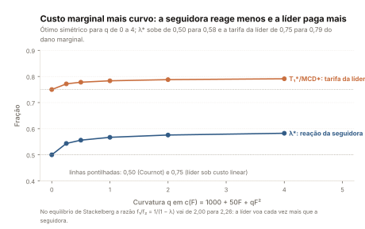
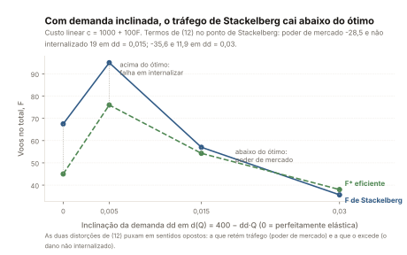
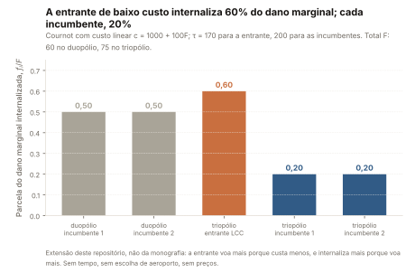

# O jogo do congestionamento: um líder de Stackelberg, derivado passo a passo

Português (ADR-0006). Este é o capítulo 3 do estudo, o centro da Parte II.
Quem o lê sai sabendo derivar, do lucro de uma empresa aérea até a tarifa
que corrige o congestionamento, o modelo de teoria dos jogos em que se
apoia o artigo replicado por este repositório — Bendinelli, Bettini &
Oliveira (2016, *Transportation Research Part A* 85, 39-52, doi
10.1016/j.tra.2016.01.001); daqui em diante, "o artigo". O modelo é o da
seção 4 da monografia de graduação do autor (USP, 2013), citada como
documento externo e chamada "a monografia"; ele segue Brueckner e Van
Dender (2008) e, nos casos de referência, Brueckner (2002). O capítulo 2
([02-teoria-dos-jogos-fundamentos.md](02-teoria-dos-jogos-fundamentos.md))
ensina os conceitos que este capítulo usa — resposta ótima, equilíbrio de
Nash, Cournot, Stackelberg, indução retroativa e tarifa pigouviana — com a
mesma notação; o capítulo 4
([04-do-modelo-as-hipoteses.md](04-do-modelo-as-hipoteses.md)) leva os
objetos derivados aqui aos regressores do artigo.

Três rótulos dizem de quem é cada afirmação: **[BVD]**, um resultado de
Brueckner e Van Dender (2008) reenunciado; **[monografia]**, o que a
monografia afirma, citado literalmente quando é enunciado; **[aqui]**, o
que a derivação deste repositório acrescenta. As equações (1)–(12) mantêm
a numeração da monografia. Toda identidade algébrica é conferida por
`sympy` em `src/airline_delays/theory/model.py` e presa por
`tests/test_theory.py`; todo número sai de `reports/theory/model.json`, com
a chave nomeada na mesma frase ou na tabela, e nenhum é recalculado em
prosa.

## 1. O que o modelo pergunta

Duas empresas aéreas dividem o horário de pico de um aeroporto cheio. Cada
voo a mais que uma delas programa atrasa todos os voos daquele horário —
os dela e os da rival —, e o atraso custa tempo do passageiro, combustível
e tripulação em espera. A pergunta do modelo é quem paga esse custo no
momento em que a empresa decide quantos voos operar.

O planejador diria: a empresa deveria pagar o dano que o voo extra impõe a
todos os voos do aeroporto. A empresa conta só uma parte, e a parte
depende de quantos voos são seus e de como a rival reage. Quem voa metade
do pico sofre, nos próprios atrasos, metade do dano que causa; conta essa
metade e ignora a outra. Quem sabe que a rival ocupará o espaço que ela
liberar conta menos ainda. Um monopolista conta tudo; uma empresa pequena
demais para mover o congestionamento não conta nada. Por isso a resposta
depende da estrutura do mercado, e o modelo compara quatro — monopólio,
duopólio simultâneo (Cournot), duopólio sequencial (Stackelberg) e
comportamento atomístico — pela fração do dano marginal que cada uma deixa
de considerar. Essa fração é a tarifa por voo que a levaria ao volume
eficiente.

**Caixa de intuição.** *O dano marginal de congestionamento é um imposto
que ninguém cobra. Quem voa muito no pico já paga parte dele nos próprios
atrasos e, por isso, contém-se sozinho; quem voa pouco quase não o paga e
programa como se o aeroporto estivesse vazio. A tarifa eficiente cobra de
cada um exatamente a parte que ele não paga.*

**O que isso significa para o artigo.** O artigo testa se a concentração
de um aeroporto em poucas empresas reduz os atrasos — o sinal da
internalização — e se uma empresa de baixo custo altera esse efeito; a
passagem dos objetos deste capítulo para aqueles regressores é o capítulo
4 ([04-do-modelo-as-hipoteses.md](04-do-modelo-as-hipoteses.md)).

## 2. Pressupostos e notação

Antes das equações, o jogo, nos termos do capítulo 2. Os **jogadores** são
duas empresas, 1 e 2. A **estratégia** de cada uma é o seu volume de voos
no pico, $`f_i \ge 0`$; o **resultado** é o tráfego total
$`F = f_1 + f_2`$, que determina o congestionamento; o **pagamento** é o
lucro $`\pi_i(f_1, f_2)`$ da seção 3; a **informação** é completa. O que
distingue os casos é o **tempo**. Em Cournot as duas escolhem ao mesmo
tempo, e o conceito de solução é o equilíbrio de Nash: cada uma responde
otimamente ao volume da outra. Em Stackelberg a empresa 1 escolhe primeiro
e a 2 observa antes de escolher; o conceito de solução é o equilíbrio
perfeito em subjogos, obtido por indução retroativa — primeiro a resposta
ótima da seguidora, depois a escolha da líder que a antecipa.

Os símbolos, com o nome que cada um tem em
`src/airline_delays/theory/model.py`:

| símbolo | nome no código | o que é |
|---|---|---|
| $`f_1`$, $`f_2`$ | `f1`, `f2` | voos da líder e da seguidora no pico |
| $`F`$ | `F` | tráfego total, $`f_1 + f_2`$ |
| $`p`$ | `p` | preço total pago pelo passageiro (demanda horizontal no caso básico) |
| $`s`$ | `s` | assentos por aeronave, todos vendidos |
| $`\tau`$ | `tau` | custo por assento sem congestionamento |
| $`t(F)`$, $`g(F)`$ | dentro de `c` | custo de tempo por passageiro e custo operacional extra por voo, ambos causados pelo congestionamento |
| $`c(F)`$, $`c'`$, $`c''`$ | `c`, `c0`, `c1`, `c2` | $`s\,t(F) + g(F)`$, o custo do congestionamento por voo, e as suas derivadas |
| $`\lambda`$ | `lam` | $`-\partial f_2/\partial f_1`$: quantos voos a seguidora corta por voo extra da líder |
| $`x`$ | `x` | $`f_2 c''/c'`$: a única razão de que todo limite de $`\lambda`$ depende |
| $`\partial f_2/\partial f_1`$ | `slope` | a reação da seguidora, deixada livre onde a monografia a deixa livre |
| $`d(Q)`$, $`d'`$, $`d''`$ | `d`, `d0`, `d1`, `d2` | demanda inversa sobre o total de assentos $`Q = sF`$ (seção 11) |
| $`a`$, $`b`$, $`dd`$ | `a`, `b`, `dd` | o custo linear $`a + bF`$ e a inclinação da demanda linear $`d_0 - dd\,Q`$ dos exemplos |
| $`f^{*}`$ | `f_star` | o volume eficiente simétrico de (11) |

O que é suposto, e não provado, está na lista `assumptions` de
`model.json`, com o status que a derivação lhe dá:

| id | pressuposto | status |
|---|---|---|
| A1 | demanda perfeitamente elástica ao preço $`p`$ em (1)–(11); excedente do consumidor zero e bem-estar igual ao lucro conjunto | suposto |
| A2 | todo assento é vendido; $`s`$ é exógeno e igual nas duas empresas | suposto |
| A3 | $`c' > 0`$ e $`c'' \ge 0`$ (equação 5); todo limite de $`\lambda`$ é condicional a isso | suposto |
| A4 | a empresa 1 lidera e a 2 segue por hipótese; $`f_1 > f_2`$ decorre de quem lidera, não de tamanho | suposto |
| A5 | as tarifas de (10)–(11) são constantes por voo avaliadas na alocação eficiente e não alteram a reação da seguidora | suposto |
| A6 | a "Pressuposição 2" precisa de $`-1 < \partial f_2/\partial f_1 \le -\tfrac12`$ | vale se e somente se $`c''/s \ge s^2 d''`$; conferida simbolicamente para $`d'' = 0`$ e numericamente para demanda linear (seção 11) |
| A7 | a "Pressuposição 3": a entrada de uma empresa de baixo custo quebra a estrutura de Stackelberg e a entrante tem incentivo a internalizar | verbal na monografia; ilustrada pela extensão de Cournot deste repositório (seção 12) |
| A8 | existência e unicidade de um equilíbrio interior | verificada numericamente só para os parâmetros escolhidos |

**O que isso significa para o artigo.** A1 e A4 são o que o artigo relaxa
na prática — os preços variam por rota e nenhuma empresa é declarada
líder; o que sobrevive é a estrutura de incentivos, e é ela que os
regressores medem.

## 3. A função de lucro, termo a termo

O passageiro está disposto a pagar um preço total $`p`$ pela viagem. Como
o congestionamento lhe impõe um custo de tempo $`t(F)`$, com $`t' > 0`$ e
$`t'' \ge 0`$, a tarifa que a empresa consegue cobrar é o preço total menos
esse custo. Com $`s`$ assentos vendidos por voo, a receita da empresa
$`i`$ é

```math
R_i = [\,p - t(f_1 + f_2)\,]\, s\, f_i, \qquad i = 1, 2 \tag{1}
```

**[monografia]** A receita cai quando o tráfego total sobe, mesmo com
$`p`$ fixo: o passageiro desconta da tarifa o tempo que perde. Do lado do
custo, cada assento custa $`\tau`$ a produzir, e o congestionamento
acrescenta um custo operacional $`g(F)`$ por voo, com $`g \ge 0`$,
$`g' > 0`$ e $`g'' \ge 0`$. O lucro é receita menos custo:

```math
\pi_i = [\,p - t(f_1 + f_2)\,]\, s\, f_i - [\,\tau s + g(f_1 + f_2)\,]\, f_i \tag{2}
```

Os dois custos do congestionamento — o do passageiro, $`s\,t(F)`$ por voo,
e o da empresa, $`g(F)`$ — entram no lucro do mesmo jeito: subtraindo, por
voo, uma quantia que cresce com $`F`$. A monografia os junta numa função
só, a sua equação (5) — a ordem em que ela apresenta as equações explica
a numeração:

```math
c(F) \equiv s\, t(F) + g(F), \qquad c' > 0, \qquad c'' \ge 0 \tag{5}
```

Abrindo os colchetes de (2) e substituindo (5), o lucro fica na forma que
se usa daqui em diante:

```math
\pi_1 = (p - \tau)\, s\, f_1 - c(f_1 + f_2)\, f_1 \tag{3}
```

```math
\pi_2 = (p - \tau)\, s\, f_2 - c(f_1 + f_2)\, f_2 \tag{4}
```

O primeiro termo é a receita líquida por voo sem congestionamento,
$`(p - \tau)s`$, vezes os voos; o segundo é o custo do congestionamento por
voo vezes os voos. O que liga as duas empresas é só $`c(F)`$: o lucro de
cada uma depende do que a outra faz apenas através do tráfego total. Os
sinais de $`c'`$ e $`c''`$ herdam-se de $`t`$ e $`g`$ e são o pressuposto
A3.

**Caixa de intuição.** *Por que a curvatura de $`c`$ importa. $`c' > 0`$
diz que cada voo a mais torna o congestionamento mais caro para todos;
$`c'' \ge 0`$ diz que esse encarecimento não desacelera. Tudo o que vem
depois — quanto a seguidora reage, quanto a líder internaliza, quanto vale
a tarifa — depende dessas duas derivadas e de nada mais. Por isso a
verificação simbólica trabalha com $`c`$ genérica, e os exemplos numéricos
usam $`c`$ linear, onde $`c'' = 0`$, e quadrática, onde $`c'' > 0`$.*

**O que isso significa para o artigo.** $`c' > 0`$ é a razão para esperar
sinal positivo nos voos do pico (`dailyflcong`) e no estado de
congestionamento do aeroporto (`maxprdel`): mais tráfego no horário
congestionado, mais atraso para todos.

## 4. O ótimo social

Com demanda horizontal o excedente do consumidor é zero: o passageiro paga
exatamente o que a viagem vale para ele. O bem-estar é então o lucro
conjunto, $`W = \pi_1 + \pi_2 = (p - \tau)\, s\, F - c(F)\, F`$, e o
planejador escolhe $`F`$ para maximizá-lo — as derivadas em $`f_1`$ e
$`f_2`$ são idênticas, porque as empresas entram em $`W`$ só via $`F`$.
Derivando em $`F`$ e dividindo por $`s`$, para ler a condição por assento,

```math
p - \tau - \frac{F\, c'(F) + c(F)}{s} = 0 \tag{6}
```

**[monografia]** O volume é eficiente quando o preço total iguala o custo
marginal social de um assento. Leia o numerador. $`c(F)`$ é o custo de
congestionamento do próprio voo. $`F\,c'(F)`$ é o custo que esse voo impõe
a **todos** os $`F`$ voos do aeroporto: cada um fica $`c'`$ mais caro, e
há $`F`$ deles. O planejador conta os dois porque nenhum voo é "dos
outros" para ele. O segundo termo tem nome: $`\mathrm{MCD} \equiv F\,c'(F)`$
é o dano marginal de congestionamento (`tolls.MCD`), o custo que um voo a
mais impõe ao conjunto dos voos existentes, o dele próprio incluído. É como
fração de $`\mathrm{MCD}`$ que toda tarifa deste capítulo será medida.

Como linha numérica: no exemplo linear de `model.json`, com $`p = 300`$,
$`\tau = 200`$, $`s = 100`$ e $`c(F) = 1000 + 100F`$
(`examples.linear.primitives` e `.cost`), o ótimo é $`F^{*} = 45`$, com
$`\mathrm{MCD}^{*} = 4.500`$ (`examples.linear.social_optimum.F_star` e
`examples.linear.tolls_at_symmetric_optimum.MCD_star`).

**Caixa de intuição.** *Para o planejador não existe "meu atraso" e
"atraso do outro": um minuto perdido num voo da empresa 2 pesa tanto
quanto num voo da empresa 1. A empresa só sente o atraso dos próprios
voos. Toda a diferença entre (6) e as condições privadas das seções
seguintes está em quantos dos $`F`$ voos a empresa considera seus.*

**O que isso significa para o artigo.** O ótimo social é a régua: o que o
artigo mede nos atrasos é a distância entre o comportamento observado das
empresas e essa régua, estrutura de mercado por estrutura de mercado.

## 5. A seguidora

Na indução retroativa começa-se pelo fim. A empresa 2 observa $`f_1`$ e
escolhe $`f_2`$ para maximizar (4), tomando $`f_1`$ como dado. Derivando
(4) em $`f_2`$ — o custo $`c(F)`$ sobe $`c'`$ e multiplica $`f_2`$ voos — e
dividindo por $`s`$,

```math
p - \tau - \frac{f_2\, c' + c}{s} = 0 \tag{7}
```

**[monografia]** Compare com (6): onde o ótimo social carrega $`F\,c'`$, a
seguidora carrega só $`f_2\,c'`$. Ela internaliza o dano que impõe aos
próprios voos e ignora o que impõe aos voos da rival. É a condição de um
duopolista de Cournot (capítulo 2), e a raiz de tudo o que vem depois.

O que a indução retroativa faz com (7) é lê-la como uma função: para cada
$`f_1`$, (7) determina o $`f_2`$ ótimo — a **função de reação**
$`f_2(f_1)`$ —, e a pergunta central do modelo é quanto $`f_2`$ cai
quando $`f_1`$ sobe. Escreva (7) antes da divisão por $`s`$ como
$`\Phi(f_1, f_2) = (p - \tau)s - c(F) - f_2\, c'(F)`$. Um voo a mais da
líder move $`\Phi`$ por $`\partial \Phi/\partial f_1 = -c' - f_2 c''`$,
porque $`c`$ sobe $`c'`$ e $`f_2 c'`$ sobe $`f_2 c''`$; um voo a mais da
própria seguidora move $`\Phi`$ por
$`\partial \Phi/\partial f_2 = -2c' - f_2 c''`$, com dois $`c'`$, porque
$`f_2`$ move $`F`$ e é também o multiplicador de $`f_2 c'`$. Para (7)
continuar valendo, o teorema da função implícita dá

```math
\frac{\partial f_2}{\partial f_1} = -\,\frac{\partial \Phi/\partial f_1}{\partial \Phi/\partial f_2} = -\,\frac{c' + f_2\, c''}{2c' + f_2\, c''} \equiv -\lambda \tag{8}
```

(`reaction_slope.expression`): a seguidora reduz voos quando a líder
aumenta os dela, e $`\lambda`$ é quantos voos ela corta por voo extra da
líder.

**[aqui]** Toda a informação de (8) cabe numa razão. Com
$`x \equiv f_2\, c''/c' \ge 0`$ (`reaction_slope.x`), dividir numerador e
denominador por $`c'`$ dá $`\lambda = (1 + x)/(2 + x)`$
(`reaction_slope.lambda_of_x`), e os dois limites da monografia viram uma
linha de álgebra cada:

```math
\lambda - \tfrac12 = \frac{x}{2\,(2 + x)} \ge 0, \qquad 1 - \lambda = \frac{1}{2 + x} > 0
```

(`reaction_slope.lambda_minus_half` e `reaction_slope.one_minus_lambda`).
Logo $`\tfrac12 \le \lambda < 1`$ — `reaction_slope.lambda_lower` vale 0,5
e `reaction_slope.lambda_upper_exclusive` vale 1 —, com $`\lambda = \tfrac12`$
se e somente se $`c'' = 0`$ (`reaction_slope.lambda_linear_cost`, 0,5).

**[monografia]** A seguidora corta entre metade e a totalidade de cada voo
extra da líder: metade exata sob custo marginal constante, e mais quanto
mais crescente esse custo. Cada limite tem a sua intuição:

- **O limite inferior, $`\tfrac12`$.** Sob custo linear, um voo da líder
  encarece o custo marginal da seguidora em $`c'`$; cada voo que a
  seguidora corta o barateia em $`2c'`$ — $`c`$ cai $`c'`$ e $`f_2 c'`$
  cai outro $`c'`$. Para voltar à sua condição ela corta meio voo. Com
  $`c'' > 0`$ o voo da líder também eleva $`c'`$, e com ele o termo
  $`f_2 c'`$ que a seguidora já conta: o incentivo a cortar cresce, e ela
  corta mais que a metade.
- **O limite superior, 1, nunca atingido.** Se a seguidora cortasse um voo
  inteiro por voo da líder, $`F`$ e $`c(F)`$ ficariam onde estavam, mas o
  seu termo próprio $`f_2 c'`$ teria caído em $`c'`$: ela estaria abaixo do
  seu ótimo. Cortar alivia o congestionamento, e parte do motivo para
  cortar desaparece no caminho.


*A reação da seguidora no exemplo linear, $`f_2(f_1) = (D - b f_1)/(2b)`$,
de inclinação $`-0{,}5`$ (`reports/theory/figures.json`, `fig6`, chave
`reaction_slope`), a reação simétrica da empresa 1 no jogo simultâneo, e os
três pontos que as seções seguintes derivam: o equilíbrio de Stackelberg em
$`(45;\ 22{,}5)`$, o de Cournot em $`(30;\ 30)`$, onde as duas reações se
cruzam, e o ótimo simétrico em $`(22{,}5;\ 22{,}5)`$ (`fig6.points`).*

Como linha numérica: no exemplo quadrático, com
$`c(F) = 1000 + 50F + F^2`$ (`examples.quadratic.cost`), a seguidora corta
$`\lambda = 0{,}5488`$ voo por voo extra da líder no equilíbrio
(`examples.quadratic.stackelberg.lam`) — acima da metade, porque ali
$`c'' > 0`$.

**O que isso significa para o artigo.** A função de reação é a forma
teórica do mecanismo de compensação que Daniel e Harback (2008) descrevem:
o espaço que uma empresa libera no pico é parcialmente ocupado pela outra.
É por ele que a concentração do aeroporto pode reduzir os atrasos menos do
que a internalização própria sugeriria.

## 6. A líder

A líder conhece a reação da seguidora e escolhe $`f_1`$ sabendo que
$`f_2`$ responderá. Substitua $`f_2 = f_2(f_1)`$ em (3) e derive pela regra
da cadeia: $`F`$ move-se em $`1 + \partial f_2/\partial f_1`$ por voo extra
da líder, e não em 1, de modo que
$`\partial c/\partial f_1 = c'\,(1 + \partial f_2/\partial f_1)`$.
Dividindo por $`s`$,

```math
p - \tau - \frac{1}{s}\left[\, f_1\, c' \left(1 + \frac{\partial f_2}{\partial f_1}\right) + c \,\right] = 0 \tag{9}
```

**[monografia]** O fator $`(1 + \partial f_2/\partial f_1) = 1 - \lambda`$
é o coração do modelo. Comparado com Cournot, onde esse fator é 1, a líder
internaliza **menos**: ela antecipa que, se cortar voos para aliviar o
pico, a seguidora ocupará parte do espaço — o mecanismo de compensação de
Daniel e Harback (2008) —, e o seu incentivo a conter o congestionamento
encolhe na proporção $`1 - \lambda`$. Como $`\tfrac12 \le \lambda < 1`$, o
fator fica entre 0 e $`\tfrac12`$. "Internalizar menos que Cournot" tem,
portanto, um sentido preciso: um duopolista de Cournot conta $`f_i\,c'`$,
o dano que os seus voos sofrem; a líder conta $`f_1\,c'\,(1 - \lambda)`$,
o mesmo dano só na fração do voo extra que sobrevive à reação da
seguidora. O resto ela sabe que a seguidora desfará, e não o conta.

**[aqui]** A monografia conclui daí que $`f_1 > f_2`$; dá para dizer mais.
Em (7) e (9) aparece a mesma receita líquida por assento,
$`p - \tau - c/s`$: a primeira a iguala a $`f_2\,c'/s`$, a segunda a
$`f_1\,c'\,(1 - \lambda)/s`$. Onde ambas valem,
$`f_2\,c' = f_1\,c'\,(1 - \lambda)`$, ou seja, $`f_1 = f_2/(1 - \lambda)`$
(`leader_follower.f1`). Como $`1 - \lambda = 1/(2 + x)`$, vem
$`f_1 = f_2\,(2 + x)`$ e portanto $`f_1 - 2f_2 = f_2\,x \ge 0`$
(`leader_follower.f1_minus_2_f2`): a líder opera **pelo menos o dobro** dos
voos da seguidora, e exatamente o dobro sob custo linear
(`leader_follower.statement`) — a desigualdade da monografia com a
constante que faltava.

Como linha numérica: no exemplo linear a líder voa 45 e a seguidora 22,5
(`examples.linear.stackelberg.f1` e `.f2`), razão 2; no quadrático, 39,2613
e 17,7163 (`examples.quadratic.stackelberg.f1` e `.f2`), razão 2,2161
(`comparative_statics.cost_curvature`, linha $`q = 1`$, chave
`f1_over_f2`), igual a $`1/(1 - \lambda)`$ com o $`\lambda`$ de 0,5488 da
seção 5.

**Caixa de intuição.** *A vantagem de mover primeiro. A líder não é maior
porque é mais eficiente — as duas têm o mesmo custo (A2). Ela é maior
porque escolhe antes e sabe que cada voo seu afasta meio voo da rival. O
mesmo conhecimento que a faz grande a faz internalizar menos: quem sabe
que a rival preenche o espaço tem menos razão para deixá-lo vazio.*

**O que isso significa para o artigo.** O fator $`1 - \lambda`$ é a razão
teórica para esperar que a empresa dominante de um aeroporto internalize,
mas menos do que a sua participação sugeriria; é o objeto por trás do
regressor de concentração no aeroporto (`maxcthhi`) e do sinal negativo
que o capítulo 4 espera dele.

## 7. As tarifas que restauram o ótimo

Líder e seguidora erram por motivos diferentes, e as tarifas que as
levariam ao ótimo diferem. Uma tarifa por voo entra em (3) e (4) como um
custo a mais, e a eficiente é a pigouviana do capítulo 2: o dano marginal
que a empresa deixa de considerar. Para a líder é a diferença entre o
termo $`F\,c'`$ de (6) e o termo $`f_1\,c'\,(1 - \lambda)`$ de (9):

```math
T_1 = F\, c' - f_1\, c'\,(1 - \lambda) = \left( f_2 - f_1\, \frac{\partial f_2}{\partial f_1} \right) c' = \frac{(f_2 + \lambda f_1)\; \mathrm{MCD}}{f_1 + f_2} \tag{10}
```

com $`\mathrm{MCD} = (f_1 + f_2)\,c'`$. As duas formas coincidem
(`tolls.leader_difference_form` e `tolls.leader_share_form`; identidade
`eq10_two_forms`), e cada uma diz uma coisa. A forma de diferença diz de
onde vem a tarifa: o dano aos voos da seguidora, $`f_2\,c'`$, que a líder
nunca contou, mais o dano aos próprios voos que ela deixa de contar por
causa da reação, $`\lambda f_1\,c'`$. A forma de participação a expressa
como fração do dano marginal. Para a seguidora, o mesmo cálculo com (7) no
lugar de (9) dá $`T_2 = F\,c' - f_2\,c' = f_1\,c'`$ (`tolls.follower`): a
tarifa de Cournot pura, os voos da **rival** vezes o custo marginal. Na
alocação eficiente, simétrica porque as empresas são iguais,
$`f_1 = f_2 = f^{*}`$, tem-se $`\mathrm{MCD}^{*} = 2f^{*}c'`$ e
$`T_1^{*} = f^{*}(1 + \lambda^{*})\,c'`$:

```math
T_1^{*} = \tfrac12\,(1 + \lambda^{*})\, \mathrm{MCD}^{*}, \qquad T_2^{*} = \tfrac12\, \mathrm{MCD}^{*} \tag{11}
```

(`tolls.leader_symmetric_share` e `tolls.follower_over_MCD`, 0,5).
**[BVD]** É a Proposição 1 de Brueckner e Van Dender (2008), que a
monografia reenuncia:

> Proposição 1: Com um líder de Stackelberg e um seguidor, do seguidor é
> cobrada tarifa de congestionamento ao estilo Cournot. Do líder é cobrada
> uma tarifa que fica entre o valor de Cournot e da tarifa atomística (o
> que equivale a 100 por cento do dado do congestionamento marginal de um
> voo extra).
>
> (monografia, seção 4.3 — documento externo)

O comportamento da líder empurra a tarifa em direção à estrutura
atomística sem chegar a ela: $`\tfrac12 \le (1 + \lambda^{*})/2 < 1`$,
porque $`\lambda^{*} < 1`$.

**[aqui]** Sob custo linear $`\lambda^{*} = \tfrac12`$, e (11) vira um
número: $`T_1^{*} = \tfrac34\,\mathrm{MCD}^{*}`$, com
`tolls.leader_over_MCD_linear` valendo 0,75 (`leader_over_MCD_linear_exact`,
3/4) — **exatamente a meio caminho** entre a tarifa de Cournot
(`tolls.cournot_over_MCD`, 0,5) e a atomística (`tolls.atomistic_over_MCD`,
1). A monografia escreve que a tarifa "situa-se entre a metade da tarifa
de Cournot e a tarifa atomística" (seção 4.3 — documento externo); a frase
é tradução truncada de *halfway between*, "a meio caminho entre", e não "a
metade da tarifa de Cournot", que seria $`\tfrac14\,\mathrm{MCD}^{*}`$ e
contradiria a Proposição 1 da mesma página. O valor é $`\tfrac34`$, o que a
identidade `eq11_linear_3_4` confere.

**[aqui]** As tarifas (10) e (11) valem no ótimo. No **próprio equilíbrio
de Stackelberg**, onde $`f_2 = (1 - \lambda) f_1`$ pela seção 6, a forma de
participação colapsa:
$`T_1 = (f_2 + \lambda f_1)\,c' = [(1 - \lambda) f_1 + \lambda f_1]\,c' = f_1\,c' = T_2`$
(identidade `T1_equals_T2_at_stackelberg`). Ali as duas precisam da
**mesma** tarifa por voo, por razões diferentes — a seguidora porque ignora
os voos da líder, a líder porque antecipa a compensação.


*As tarifas de (11) como fração de $`\mathrm{MCD}^{*}`$, por estrutura de
mercado: monopólio 0; Cournot e seguidora 0,5; líder de Stackelberg 0,75
sob custo linear e 0,7835 sob custo quadrático, onde $`\lambda^{*}`$ vale
0,5670; atomístico 1 (`reports/theory/figures.json`, `fig7.quantities`).*

A comparação que a Figura 7 desenha, lida do bloco `tolls` de `model.json`:

| estrutura | o que internaliza | tarifa ÷ $`\mathrm{MCD}^{*}`$ | chave em `tolls` |
|---|---|---|---|
| monopólio | todo o dano marginal | 0 | `monopoly_over_MCD` |
| duopolista de Cournot, e a seguidora de Stackelberg | a própria parcela, $`f_i/F`$ | 0,5 | `cournot_over_MCD`, `follower_over_MCD` |
| líder de Stackelberg | menos que a própria parcela | $`(1 + \lambda^{*})/2`$; 0,75 sob custo linear | `leader_symmetric_share`, `leader_over_MCD_linear` |
| atomística | nada | 1 | `atomistic_over_MCD` |

Como linha numérica, no exemplo linear: $`\mathrm{MCD}^{*} = 4.500`$,
$`T_1^{*} = 3.375`$ e $`T_2^{*} = 2.250`$
(`examples.linear.tolls_at_symmetric_optimum.MCD_star`, `.T1_star` e
`.T2_star`) — a razão entre 3.375 e 4.500 é os três quartos.

**Caixa de intuição.** *Uma tarifa não é castigo, é informação: põe na
conta de cada voo o custo que ele impõe a quem não é da empresa. O
monopolista, que já conta esse custo sozinho, não precisa dela; a empresa
atomística, que não conta nada, precisa dela inteira; a líder de
Stackelberg precisa de três quartos porque conta um quarto — metade da
própria parcela, que é metade do total.*

**O que isso significa para o artigo.** A Proposição 1 ordena as
estruturas de mercado pela fração do dano que deixam de considerar. É essa
ordem que o artigo procura nos dados: menos atraso onde o aeroporto é mais
concentrado, com a ressalva de que uma líder internaliza menos do que a
sua participação.

## 8. Casos de referência: Cournot, atomístico, monopólio

Três estruturas calibram a escala, e as suas condições de primeira ordem
por assento estão no bloco `benchmarks` de `model.json`; os três casos são os
de Brueckner (2002). Sob **Cournot**, cada empresa maximiza o próprio lucro tomando o
volume da outra como dado, e de (3) sai $`p - \tau - (f_1\,c' + c)/s = 0`$
(chave `cournot`): a empresa 1 internaliza $`f_1\,c'`$, o dano que impõe
aos próprios voos, mas não $`f_2\,c'`$, o que impõe aos voos da rival; a
tarifa que fecha a diferença é os voos da rival vezes $`c'`$, na simetria
$`\tfrac12\,\mathrm{MCD}`$ (identidade `cournot_toll_half_at_symmetry`).
Sob comportamento **atomístico**, a empresa ignora que os seus voos
congestionam: $`p - \tau - c/s = 0`$ (chave `atomistic`), sem termo
$`c'`$ nenhum, e a tarifa que a corrige é o dano marginal inteiro. Sob
**monopólio**, a empresa maximiza $`(p - \tau)\,s\,F - c(F)\,F`$, e a sua
condição coincide com (6) (identidade `monopoly_foc_is_social`; chave
`monopoly`): internaliza tudo, e a tarifa é zero. Internalização não é
virtude, é consequência de ser dona de todos os voos.

**[aqui]** Com custo linear $`c(F) = a + bF`$ e
$`D \equiv (p - \tau)\,s - a`$ — a receita líquida por voo sem
congestionamento menos a parte fixa do custo — tudo tem forma fechada
(`linear_closed_forms`). A reação da seguidora sai de (7):
$`D - b f_1 - 2b f_2 = 0`$, ou $`f_2 = (D - b f_1)/(2b)`$, a reta da Figura
6. As demais são:

| estrutura | forma fechada | chave em `linear_closed_forms` | perda ÷ $`W^{*}`$ | chave |
|---|---|---|---|---|
| ótimo social | $`F^{*} = D/(2b)`$ | `F_star` | 0 | — |
| monopólio | $`F = D/(2b)`$, o mesmo que $`F^{*}`$ | — | 0 | — |
| Cournot | $`f = D/(3b)`$ por empresa | `f_cournot` | $`1/9`$ | `loss_share_cournot` |
| Stackelberg | $`f_1 = D/(2b)`$, $`f_2 = D/(4b)`$ | `f1_stackelberg`, `f2_stackelberg` | $`1/4`$ | `loss_share_stackelberg` |
| atomístico | $`F = D/b`$, o dobro do eficiente | `F_atomistic` | 1 | `loss_share_atomistic` |

As perdas são frações exatas de $`W^{*}`$ (identidade
`linear_welfare_losses`), e a sua ordem é a lição: Stackelberg perde
**mais** que Cournot — $`1/4`$ contra $`1/9`$, ou 0,25 contra 0,1111 nas
chaves `loss_share_stackelberg_float` e `loss_share_cournot_float` —
porque o $`1 - \lambda`$ de (9) corrói o incentivo da líder a conter voos;
e o total atomístico, $`D/b`$, é o dobro do eficiente e dissipa todo o
excedente. Como linha numérica, com $`D = 9.000`$ (o $`D`$ das
incumbentes em `extension_lcc.duopoly_cournot.D`) e $`b = 100`$: cada
duopolista de Cournot voa 30 e as atomísticas voam 90 no total
(`examples.linear.cournot.f1` e `.atomistic.F`).

**O que isso significa para o artigo.** Os casos de referência dizem que o
efeito da concentração sobre o atraso não é monotônico em geral: quem
lidera internaliza menos que um duopolista simétrico. O artigo, por isso,
separa a concentração na rota da concentração no aeroporto.

## 9. Exemplo numérico completo

Os dois exemplos sem poder de mercado de `model.json` usam os mesmos
primitivos — $`p = 300`$, $`\tau = 200`$, $`s = 100`$ — e diferem no
custo: linear, $`c(F) = 1000 + 100F`$ (`examples.linear.cost`), e
quadrático, $`c(F) = 1000 + 50F + F^2`$ (`examples.quadratic.cost`). Cada
linha abaixo é o bloco de mesmo nome dentro do exemplo; o bem-estar é a
chave `welfare` (`welfare_star` no ótimo) e a perda, a chave `loss_share`.

| estrutura (`examples.linear`) | $`f_1`$ | $`f_2`$ | $`F`$ | lucro 1 | lucro 2 | $`W`$ | perda ÷ $`W^{*}`$ |
|---|---|---|---|---|---|---|---|
| ótimo social (`social_optimum`) | 22,5 | 22,5 | 45 | — | — | 202.500 | 0 |
| monopólio (`monopoly`) | — | — | 45 | — | — | 202.500 | 0 |
| Cournot (`cournot`) | 30 | 30 | 60 | 90.000 | 90.000 | 180.000 | 0,1111 |
| Stackelberg (`stackelberg`) | 45 | 22,5 | 67,5 | 101.250 | 50.625 | 151.875 | 0,25 |
| atomístico (`atomistic`) | — | — | 90 | — | — | 0 | 1 |

O mesmo quadro sob custo quadrático, onde $`c'' > 0`$ e nada é inteiro:

| estrutura (`examples.quadratic`) | $`f_1`$ | $`f_2`$ | $`F`$ | lucro 1 | lucro 2 | $`W`$ | perda ÷ $`W^{*}`$ |
|---|---|---|---|---|---|---|---|
| ótimo social (`social_optimum`) | 20,2926 | 20,2926 | 40,5852 | — | — | 216.058,6216 | 0 |
| monopólio (`monopoly`) | — | — | 40,5852 | — | — | 216.058,6216 | 0 |
| Cournot (`cournot`) | 25,4516 | 25,4516 | 50,9032 | 98.337,5346 | 98.337,5346 | 196.675,0692 | 0,0897 |
| Stackelberg (`stackelberg`) | 39,2613 | 17,7163 | 56,9776 | 114.041,3555 | 51.460,1172 | 165.501,4727 | 0,2340 |
| atomístico (`atomistic`) | — | — | 73,1071 | — | — | 0 | 1 |

Agora o equilíbrio linear de Stackelberg à mão, só com as formas fechadas
da seção 8 e os parâmetros do bloco — nenhum número novo aparece:

1. **A receita líquida.** $`D = (p - \tau)\,s - a`$ com $`p = 300`$,
   $`\tau = 200`$, $`s = 100`$ e $`a = 1000`$ dá $`D = 9.000`$
   (`extension_lcc.duopoly_cournot.D`).
2. **A reação da seguidora.** De (7) com $`c = a + bF`$:
   $`f_2(f_1) = (D - b f_1)/(2b)`$. Cada voo da líder custa meio voo à
   seguidora — o $`\lambda = \tfrac12`$ da seção 5.
3. **A escolha da líder.** Substituindo a reação em (9) com
   $`1 - \lambda = \tfrac12`$: $`D - b(f_1 + f_2(f_1)) - \tfrac12\,b f_1 = 0`$,
   que se reduz a $`D - 2b f_1 = 0`$. Logo $`f_1 = D/(2b) = 45`$
   (`examples.linear.stackelberg.f1`) — o mesmo número que o total
   eficiente $`F^{*} = D/(2b) = 45`$: a líder sozinha voa o que o
   aeroporto inteiro deveria voar.
4. **A resposta da seguidora.** $`f_2 = (D - b f_1)/(2b) = D/(4b) = 22{,}5`$
   (`.f2`), e o total é $`F = 67{,}5`$ (`.F`), metade a mais que o ótimo.
5. **O dano e as tarifas.** $`\mathrm{MCD} = F\,c' = 6.750`$ (`.MCD`);
   $`T_1 = T_2 = f_1\,c' = 4.500`$ (`.T1`, `.T2`), ou 0,6667 do dano
   marginal ali (`.T1_over_MCD`) — entre 0,5 e 0,75, porque o equilíbrio
   não é o ótimo.
6. **A perda.** $`W^{*} = 202.500`$ e $`W = 151.875`$
   (`.social_optimum.welfare_star` e `.stackelberg.welfare`); a diferença,
   50.625 (`.stackelberg.loss`), é $`1/4`$ de $`W^{*}`$
   (`.stackelberg.loss_share`, 0,25), como a forma fechada previa.

**Caixa de intuição.** *Leia a tabela linear de baixo para cima. As
atomísticas voam 90 e dissipam tudo; a líder e a seguidora voam 67,5 e
perdem um quarto; os duopolistas de Cournot voam 60 e perdem um nono; o
monopolista voa 45 e nada perde. Cada degrau é uma fração a mais do dano
marginal levada em conta.*

**O que isso significa para o artigo.** Os números são estilizados —
escolhidos em `src/airline_delays/theory/families.py` para que o caso
linear tenha equilíbrios inteiros — e não calibrados a nenhum aeroporto;
o que o artigo leva deles é a ordem das estruturas, não as magnitudes.

## 10. Estática comparativa: a curvatura do custo

**[aqui]** O que muda quando o custo marginal do congestionamento acelera?
O bloco `comparative_statics.cost_curvature` de `model.json` varia $`q`$
em $`c(F) = 1000 + 50F + qF^2`$, com demanda perfeitamente elástica e os
mesmos primitivos; note que aqui $`b = 50`$, e por isso o caso $`q = 0`$
tem $`F^{*} = 90`$, não os 45 do exemplo linear da seção 9.

| $`q`$ | $`F^{*}`$ | $`\lambda^{*}`$ | $`T_1^{*}/\mathrm{MCD}^{*}`$ | $`\lambda`$ em Stackelberg | $`f_1/f_2`$ | $`T_1/\mathrm{MCD}`$ | perda ÷ $`W^{*}`$ |
|---|---|---|---|---|---|---|---|
| 0 | 90 | 0,5 | 0,75 | 0,5 | 2 | 0,6667 | 0,25 |
| 0,25 | 61,5692 | 0,5435 | 0,7717 | 0,5346 | 2,1489 | 0,6824 | 0,2394 |
| 0,5 | 50,9941 | 0,5560 | 0,7780 | 0,5424 | 2,1856 | 0,6861 | 0,2365 |
| 1 | 40,5852 | 0,5670 | 0,7835 | 0,5488 | 2,2161 | 0,6891 | 0,2340 |
| 2 | 31,2829 | 0,5758 | 0,7879 | 0,5535 | 2,2399 | 0,6913 | 0,2320 |
| 4 | 23,5346 | 0,5825 | 0,7912 | 0,5571 | 2,2576 | 0,6930 | 0,2305 |

As colunas são, na ordem, as chaves `q`, `F_star`, `lambda_star`,
`T1_star_over_MCD`, `stackelberg_lambda`, `f1_over_f2`, `T1_over_MCD` e
`loss_share` de cada linha do bloco.



*$`\lambda^{*}`$ e $`T_1^{*}/\mathrm{MCD}^{*}`$ no ótimo simétrico à
medida que $`q`$ vai de 0 a 4: de 0,5 a 0,5825 e de 0,75 a 0,7912
(`reports/theory/figures.json`, `fig8.quantities`, chaves `lambda_star` e
`T1_star_over_MCD`).*

Quatro leituras. Quanto mais curvo o custo, mais a seguidora recua
($`\lambda^{*}`$ sobe), porque um voo da líder eleva também $`c'`$ e com
ele o termo próprio que a seguidora já conta. Menos a líder internaliza, e
mais a sua tarifa se aproxima da atomística — sem alcançá-la, porque
$`\lambda < 1`$. A razão $`f_1/f_2`$ sobe de 2 na direção de
$`1/(1 - \lambda)`$. E a perda de Stackelberg **cai** em fração de
$`W^{*}`$, porque o ótimo também encolhe quando o congestionamento
acelera.

**O que isso significa para o artigo.** A diferença entre a tarifa de
Cournot e a da líder é maior justamente onde o congestionamento acelera
mais depressa — os aeroportos saturados. É ali que a distinção entre
internalizar a própria parcela e internalizar menos que ela tem mais
consequência empírica.

## 11. Demanda inelástica e a "Pressuposição 2"

Até aqui as empresas não tinham poder de mercado: o preço era dado. A
monografia relaxa isso na sua seção 4.4 com $`p = d(sF)`$, $`d' < 0`$ — o
preço cai com o total de assentos, e cada empresa sabe que os seus voos o
derrubam. O lucro da líder passa a ser
$`\pi_1 = d\big(s(f_1 + f_2(f_1))\big)\, s f_1 - \tau s f_1 - c\big(f_1 + f_2(f_1)\big)\, f_1`$;
agora a regra da cadeia atinge dois lugares — o preço e o custo — e cada um
carrega o fator $`1 + \partial f_2/\partial f_1`$. Dividindo por $`s`$:

```math
d + s\, f_1\, d' \left(1 + \frac{\partial f_2}{\partial f_1}\right) - \tau - \frac{1}{s}\left[\, f_1\, c' \left(1 + \frac{\partial f_2}{\partial f_1}\right) + c \,\right] = 0 \tag{12}
```

(`inelastic.leader_foc`). A condição eficiente sai de maximizar o excedente
total, $`\int_0^{sF} d(q)\,dq - \tau s F - c(F)\,F`$, e é (6) com $`d`$ no
lugar de $`p`$: $`d - \tau - [F\,c' + c]/s = 0`$ (`inelastic.social_foc`).
**[monografia]** Comparar (12) com ela revela **duas** distorções, de
sinais opostos. O termo $`s f_1 d'(1 - \lambda) < 0`$ é o poder de mercado
exercido: retém tráfego para sustentar o preço. O termo
$`f_1 c'(1 - \lambda)/s > 0`$ é o dano que a líder deixa de internalizar:
excede tráfego. A monografia lê os dois extremos da reação da seguidora.
Se $`\partial f_2/\partial f_1 = -1`$, os termos com o fator somem e (12)
colapsa em $`d - \tau - c/s = 0`$ (`inelastic.limit_slope_minus_one`), a
condição atomística: a líder não internaliza nada **e** não exerce poder
de mercado nenhum, e só a parte não internalizada precisa de correção,
pela tarifa atomística inteira. Se $`\partial f_2/\partial f_1 = -\tfrac12`$,
sobra metade de cada, $`d + s f_1 d'/2 - \tau - (f_1 c'/2 + c)/s = 0`$
(`inelastic.limit_slope_minus_half`): metade do poder de mercado, pelo
termo $`s f_1 d'/2 < 0`$ (`inelastic.market_power_term_at_minus_half`), e
metade da própria parcela por internalizar, pelo termo $`f_1 c'/(2s) > 0`$
(`inelastic.uninternalised_term_at_minus_half`). Daí o enunciado:

> Pressuposição 2: O líder Stackelberg, quando enfrenta uma demanda
> inelástica, maximiza seu lucro no intervalo que apresenta como limite
> inferior o caso em que não explora seu poder de mercado mas falha na
> internalização do congestionamento e, como limite superior, o caso em que
> exerce metade do seu poder de mercado sendo incapaz também de
> internalizar o congestionamento.
>
> (monografia, seção 4.4 — documento externo)

A Pressuposição 2 não é teorema novo: é a leitura dos extremos de (12),
condicional a que $`-1 < \partial f_2/\partial f_1 \le -\tfrac12`$ valha
sob demanda inelástica — limite que a monografia toma emprestado do caso
elástico, provado em (8), sem o reprovar. É o pressuposto A6.

**[aqui]** O limite pode ser derivado, e não vale sempre. Repetindo para a
seguidora sob $`p = d(sF)`$ o que a seção 5 fez sob preço fixo,
$`\partial f_2/\partial f_1 = -A/B`$ com

```math
A = \frac{c' + f_2\, c''}{s} - s\, d' - s^2 f_2\, d'', \qquad B = A + \frac{c'}{s} - s\, d'
```

(`inelastic.slope_A` e `inelastic.slope_B`; a forma completa é
`inelastic.slope_general`), e a distância até o limite é uma linha:

```math
-\frac{\partial f_2}{\partial f_1} - \tfrac12 = \frac{f_2\left(c''/s - s^2 d''\right)}{2B}
```

de modo que $`\partial f_2/\partial f_1 \le -\tfrac12`$ vale se e somente
se $`c''/s \ge s^2 d''`$ (`inelastic.slope_bounds_condition`; identidade
`lambda_inelastic_general`) — automático para demanda linear ou côncava, e
**não** garantido para demanda convexa. Com $`d'' = 0`$ a inclinação vira
$`-(k + f_2 c'')/(2k + f_2 c'')`$, com $`k = c' - s^2 d' > 0`$
(`inelastic.slope_linear_demand`; identidade `lambda_linear_demand`): a
estrutura de (8) com $`k`$ no lugar de $`c'`$, e por isso os mesmos
limites.

**[aqui]** Com custo linear e demanda linear $`d(Q) = d_0 - dd\,Q`$ tudo
volta a ter forma fechada (`inelastic.closed_forms`; identidade
`inelastic_linear_closed_forms`), em $`D_p \equiv s\,d_0 - s\,\tau - a`$ e
$`m \equiv b + dd\,s^2`$:

```math
f_1 = \frac{D_p}{2m}, \qquad f_2 = \frac{D_p}{4m}, \qquad F^{*} = \frac{D_p}{2b + dd\,s^2}
```

— as formas da seção 8 com $`D_p`$ no lugar de $`D`$ e $`m`$ no lugar de
$`b`$ nas empresas, mas não no ótimo, cujo denominador cresce só
$`dd\,s^2`$. O exemplo `examples.inelastic_linear_demand`, com
$`c = 1000 + 100F`$, $`d_0 = 400`$ e $`dd = 0{,}015`$ (`.cost` e
`.demand`), dá:

| estrutura (`examples.inelastic_linear_demand`) | $`f_1`$ | $`f_2`$ | $`F`$ | preço | perda ÷ $`W^{*}`$ |
|---|---|---|---|---|---|
| ótimo social (`social_optimum`) | 27,1429 | 27,1429 | 54,2857 | 318,5714 | 0 |
| monopólio (`monopoly`) | — | — | 38 | 343 | 0,09 |
| Cournot (`cournot`) | 25,3333 | 25,3333 | 50,6667 | 324 | 0,0044 |
| Stackelberg (`stackelberg`) | 38 | 19 | 57 | 314,5 | 0,0025 |
| atomístico (`atomistic`) | — | — | 76 | 286 | 0,16 |

Com poder de mercado o monopolista deixa de coincidir com o ótimo: voa 38
contra 54,2857 e perde 0,09 de $`W^{*}`$, porque retém tráfego para
sustentar o preço. No ponto de Stackelberg os dois termos de (12) valem
$`-28{,}5`$ (poder de mercado) e $`19`$ (parcela não internalizada), com
tarifa atomística por assento de 57 e um total que excede o ótimo em
2,7143 voos (`equation_12_terms_at_stackelberg.market_power_term`,
`.uninternalised_term`, `.atomistic_toll_per_seat` e
`.F_exceeds_optimum_by`).



*O total de Stackelberg contra o eficiente à medida que a demanda inclina,
$`dd`$ de 0 a 0,03, com custo linear $`1000 + 100F`$: 67,5 contra 45;
95 contra 76; 57 contra 54,2857; 35,625 contra 38
(`reports/theory/figures.json`, `fig9.quantities`, chaves
`F_stackelberg` e `F_star`).*

**[aqui]** Os dois termos puxam em direções opostas, e qual vence depende
da inclinação da demanda. O bloco `comparative_statics.demand_slope`
percorre $`dd`$ com o mesmo custo linear:

| $`dd`$ | $`f_1`$ | $`f_2`$ | $`F`$ | $`F^{*}`$ | preço | poder de mercado | não internalizado | perda ÷ $`W^{*}`$ |
|---|---|---|---|---|---|---|---|---|
| 0 | 45 | 22,5 | 67,5 | 45 | 300 | 0 | 22,5 | 0,25 |
| 0,005 | 63,3333 | 31,6667 | 95 | 76 | 352,5 | −15,8333 | 31,6667 | 0,0625 |
| 0,015 | 38 | 19 | 57 | 54,2857 | 314,5 | −28,5 | 19 | 0,0025 |
| 0,03 | 23,75 | 11,875 | 35,625 | 38 | 293,125 | −35,625 | 11,875 | 0,0039 |

As colunas são as chaves `dd`, `f1`, `f2`, `F`, `F_star`, `price`,
`market_power_term`, `uninternalised_term` e `loss_share`. Para $`dd = 0`$
o total de Stackelberg excede o ótimo em metade; para $`dd = 0{,}03`$ ele
cai a 35,625, **abaixo** de $`F^{*} = 38`$: demanda íngreme o bastante
faz o poder de mercado dominar, e a líder voa de menos. A Pressuposição 2
descreve o intervalo dos dois termos; não diz que a soma tenha sinal fixo,
e é por isso que a distorção líquida é uma pergunta empírica.

**Caixa de intuição.** *Poder de mercado e congestionamento não
internalizado são dois erros em sentidos contrários. O primeiro faz a
empresa voar de menos, para manter o preço alto; o segundo a faz voar de
mais, porque o atraso alheio não lhe custa nada. Uma dominante num
aeroporto saturado pode, portanto, estar mais perto do ótimo do que
qualquer dos dois erros isoladamente sugeriria.*

**O que isso significa para o artigo.** É por isso que o sinal da
concentração na rota (`rthhi`) é ambíguo na teoria: $`d' < 0`$ reduz
voos, e o dano não internalizado os aumenta. O capítulo 4 mostra como o
artigo lê esse regressor.

## 12. A entrada de uma empresa de baixo custo e a "Pressuposição 3"

A última peça da seção 4 da monografia motiva as variáveis de empresa do
artigo:

> Pressuposição 3: A entrada de uma empresa aérea de baixo custo no
> mercado quebra a estrutura do jogo em Stackelberg. Devido à estrutura do
> modelo de negócios de uma empresa aérea de baixo custo, é coerente
> pressupor que tais empresas procurem internalizar os custos do
> congestionamento, uma vez que tais custos podem afetar o planejamento
> estratégico de longo prazo da empresa que busca o crescimento de sua
> participação de mercado.
>
> (monografia, seção 4.5 — documento externo)

**[monografia]** A Pressuposição 3 é verbal: não há equação por trás
dela, e é o status A7 em `assumptions`. O terreno econômico do modelo de
negócios de baixo custo está no capítulo 1
([01-economia-do-congestionamento.md](01-economia-do-congestionamento.md)).

**[aqui]** Este repositório a converte em algo imprimível; o que segue é
**extensão deste repositório, não da monografia** (`extension_lcc.label`).
A quebra da estrutura é tomada ao pé da letra: com a entrante o jogo deixa
de ter uma líder e passa a ser um Cournot de três empresas, e a entrante
custa menos por assento. Sob custo linear a condição da empresa $`i`$ é
$`D_i - b\,F - b\,f_i = 0`$, com $`D_i \equiv (p - \tau_i)\,s - a`$;
somando sobre as $`n`$ empresas, $`\sum_i D_i - (n + 1)\,b\,F = 0`$, de
onde

```math
F = \frac{\sum_i D_i}{(n + 1)\, b}, \qquad f_i = \frac{D_i}{b} - F
```

e $`f_i/F`$ é a parcela do dano marginal que $`i`$ internaliza — a lógica
de Cournot da seção 8, agora com participações desiguais. Com duas
incumbentes a $`\tau = 200`$ e uma entrante a $`\tau = 170`$
(`extension_lcc.incumbent_tau` e `.entrant_tau`), a receita líquida por
voo é 12.000 para a entrante e 9.000 para cada incumbente
(`extension_lcc.triopoly.D`), e:

| grandeza | duopólio de Cournot | triopólio com a entrante | chave em `extension_lcc` |
|---|---|---|---|
| tráfego total $`F`$ | 60 | 75 | `duopoly_cournot.F`, `triopoly.F` |
| voos por empresa | 30 e 30 | 45 (entrante), 15 e 15 | `.flights` |
| parcela internalizada, $`f_i/F`$ | 0,5 e 0,5 | 0,6 (entrante), 0,2 e 0,2 | `.internalised_share` |
| dano marginal $`\mathrm{MCD}`$ | 6.000 | 7.500 | `.MCD` |
| bem-estar (lucro conjunto) | 180.000 | 247.500 | `.welfare` |

Para comparação, o duopólio de Stackelberg das mesmas incumbentes voa
67,5 (`extension_lcc.stackelberg_duopoly_F`).



*As parcelas internalizadas do dano marginal, $`f_i/F`$, no duopólio de
Cournot (0,5 e 0,5) e no triopólio com a entrante (0,6; 0,2; 0,2), com os
totais de 60 e 75 voos (`reports/theory/figures.json`, `fig10.quantities`).*

A entrante internaliza mais **porque voa mais**, e voa mais porque o seu
custo é menor. Esse é o sentido preciso — e o único — em que "uma empresa
de baixo custo tem incentivos a internalizar o próprio congestionamento"
vale neste modelo: internalização é função da participação, e
participação é função do custo; é argumento de tamanho, não de modelo de
negócios. O que a extensão **não** mostra: não há sequência temporal, a
quebra do jogo é imposta e não deduzida, e não há aeroporto a escolher nem
preço a fixar.

**[aqui]** A leitura que este repositório propõe é que "internalizar" tem
pelo menos **três margens**, e a Pressuposição 3 não diz por qual delas a
entrante opera. A primeira é a **reprogramação**: deslocar partidas para
fora do pico sem mudar o número de voos (Ater 2012). A segunda é a
**redução de tráfego via preço**: cobrar mais e voar menos, o canal que a
seção 13 mede. A terceira é a **escolha do aeroporto**: operar onde o
congestionamento não existe (Gudmundsson, Paleari e Redondi 2014) — a
estratégia de aeroportos secundários que a monografia atribui à entrante
brasileira do seu período. Quem internaliza pela terceira margem não
precisa da segunda, e não aparece numa regressão de preços.

**O que isso significa para o artigo.** As duas variáveis de baixo custo
do artigo — na rota (`lcc`) e em uma das cidades-extremo (`maxalccfu`) —
são a forma empírica da Pressuposição 3, e o sinal negativo esperado para
ambas vem daqui; a leitura por margens é o que permite conciliá-las com
a evidência de preços da seção seguinte.

## 13. A formulação levada aos preços: Guo, Jiang e Wan (2018)

O termo de internalização própria de Cournot — a parcela própria do dano
marginal, o $`f_i\,c'`$ da seção 8 — pode ser lido dentro da tarifa aérea.
É o que fazem Guo, Jiang e Wan (2018), construindo explicitamente sobre a
separação entre concentração de mercado e de aeroporto que o artigo
introduziu.

**O modelo, na nossa notação.** Uma empresa $`i`$ opera em vários mercados
a partir de um aeroporto A, com tráfego próprio $`q_{iA}`$ ali e atraso de
congestionamento $`D_A`$, valorado a $`\beta`$ por unidade de tempo. Ela
maximiza, mercado a mercado, $`(p - c - \beta D_A)\,q`$, e a condição de
primeira ordem em cada quantidade é

```math
p = c + \beta D_A - p'\, q + \beta\, D'_A\, q_{iA}
```

Os três primeiros termos são um Cournot comum: custo, atraso e o markup de
poder de mercado. O quarto, $`\beta\, D'_A\, q_{iA}`$, é o **markup de
internalização própria**: o $`f_i\,c'`$ da seção 8 escrito em passageiros
no lugar de voos — o atraso marginal do aeroporto vezes o tráfego próprio
da empresa **naquele aeroporto**. Quem não internaliza não tem esse termo,
e os autores sintetizam os dois casos com um indicador que o multiplica, 1
com internalização e 0 sem. Daí a hipótese testável sem medir atraso como
variável dependente: a regressão é de log-tarifa contra log-atraso,
log-passageiros da empresa no aeroporto e a **interação** dos dois, com
coeficiente positivo sob internalização.

**Dados, desenho e achado.** Tarifas do DB1B, tráfego do T-100 e atraso do
AOTP, trimestrais para 2014–2015, sem os aeroportos controlados por slots
(JFK, LGA e DCA) e com efeitos fixos de empresa, mercado e trimestre;
contra a causalidade reversa — tarifa alta reduz tráfego, que reduz
atraso — defasagem de um ano e um instrumento do AIR-21. A interação é
positiva e significante no agregado; por tipo de empresa, é positiva e
significante para as de serviço completo, entre 0,0436 e 0,0564, e não
significante para as de baixo custo, entre $`-0{,}0190`$ e $`0{,}00833`$
(Guo, Jiang e Wan 2018, Tabela 4 — documento externo). A conclusão dos
autores é que as empresas de serviço completo internalizam o
congestionamento do aeroporto e as de baixo custo não; a explicação que
oferecem não é comportamental: as de baixo custo escolhem aeroportos
menos congestionados (Gudmundsson, Paleari e Redondi 2014).

**A crítica ao artigo.** É precisa e recai sobre o desenho, não sobre o
achado: controlar por tráfego no nível do aeroporto remove o efeito de
mercado residual, mas remove **junto** o canal que opera por redução de
tráfego via preço maior; o que sobra medido no atraso é a reprogramação.

**[aqui]** Lidas pelas três margens da seção 12, a Pressuposição 3 e o
"as empresas de baixo custo não internalizam via preço" deixam de ser
contraditórios: a primeira afirma incentivo a internalizar, o segundo mede
uma margem específica, e as duas afirmações podem ser verdadeiras ao mesmo
tempo. A recepção do artigo, onde essa leitura fica registrada como
hipótese em aberto, é o capítulo 8 ([08-recepcao.md](08-recepcao.md)).

**O que isso significa para o artigo.** O artigo mediu a internalização no
atraso, controlando por tráfego do aeroporto; 2018 a mediu no preço. São
margens diferentes do mesmo objeto teórico, e a comparação entre elas é a
extensão natural que o Apêndice D lista
([apendice-d-extensoes.md](apendice-d-extensoes.md)).

## 14. Verificação simbólica e numérica

A álgebra deste capítulo não é conferida à mão. Em
`src/airline_delays/theory/model.py` cada função — lucro, condição de
primeira ordem, inclinação da reação, tarifa — é uma expressão de `sympy`
com $`c(\cdot)`$ e $`d(\cdot)`$ genéricas; a função `as_symbols` troca as
derivadas que aparecem ao diferenciar $`c(f_1 + f_2(f_1))`$ pelos símbolos
`c0`, `c1`, `c2` e `slope`, e cada identidade é a afirmação de que
`simplify(lhs - rhs) == 0`, ou, para os limites de $`\lambda`$, de que uma
expressão tem o sinal declarado sob os pressupostos. A lista `identities`
de `model.json` traz 29 enunciados (`meta.n_identities`), e os 29 valem
(`reports/summary.json`, chave `theory.n_holding`); a coluna "origem" diz
de quem é cada um:

| id | eq. | origem | o que afirma |
|---|---|---|---|
| `eq6_social_foc` | (6) | monografia | a condição eficiente é $`p - \tau - [F c' + c]/s = 0`$ |
| `eq7_follower_foc` | (7) | monografia | a condição da seguidora é $`p - \tau - [f_2 c' + c]/s = 0`$ |
| `eq8_reaction_slope` | (8) | monografia | $`\partial f_2/\partial f_1 = -(f_2 c'' + c')/(f_2 c'' + 2c')`$ |
| `eq8_lambda_of_x` | (8) | aqui | $`\lambda = (1 + x)/(2 + x)`$ com $`x = f_2 c''/c'`$ |
| `eq8_lambda_minus_half` | (8) | monografia | $`\lambda - \tfrac12 = x/(2(2 + x)) \ge 0`$, logo $`\lambda \ge \tfrac12`$ |
| `eq8_one_minus_lambda` | (8) | monografia | $`1 - \lambda = 1/(2 + x) > 0`$, logo $`\lambda < 1`$ |
| `eq8_lambda_half_when_linear` | (8) | monografia | $`\lambda = \tfrac12`$ exatamente quando $`c'' = 0`$ |
| `eq9_leader_foc` | (9) | monografia | a condição da líder é $`p - \tau - [f_1 c'(1 + \partial f_2/\partial f_1) + c]/s = 0`$ |
| `f1_over_f2` | (7), (9) | aqui | num mesmo ponto, $`f_1 = f_2/(1 - \lambda)`$ e $`f_1 - 2f_2 = f_2 x \ge 0`$ |
| `eq10_gap` | (10) | monografia | $`F c' - f_1 c'(1 - \lambda) = (f_2 + \lambda f_1) c'`$ |
| `eq10_two_forms` | (10) | monografia | $`(f_2 - f_1\, \partial f_2/\partial f_1) c' = (f_2 + \lambda f_1)\, \mathrm{MCD}/(f_1 + f_2)`$ |
| `eq11_symmetric` | (11) | BVD | em $`f_1 = f_2 = f^{*}`$: $`T_1^{*} = \tfrac12 (1 + \lambda^{*})\, \mathrm{MCD}^{*}`$ |
| `eq11_linear_3_4` | (11) | aqui | com $`c'' = 0`$ a tarifa da líder é $`\tfrac34`$ de $`\mathrm{MCD}^{*}`$, a meio caminho entre $`\tfrac12`$ e 1 |
| `eq11_follower_half` | (11) | BVD | a tarifa da seguidora, $`F c' - f_2 c' = f_1 c'`$, é $`\tfrac12\, \mathrm{MCD}^{*}`$ no ótimo simétrico |
| `monopoly_foc_is_social` | referência | Brueckner (2002) | a condição do monopolista coincide com a eficiente |
| `cournot_toll_half_at_symmetry` | referência | Brueckner (2002) | a tarifa de Cournot é os voos da rival vezes $`c'`$: $`\tfrac12\, \mathrm{MCD}`$ na simetria |
| `eq12_leader_foc` | (12) | monografia | com $`p = d(sF)`$: $`d + s f_1 d'(1 + \partial f_2/\partial f_1) - \tau - [f_1 c'(1 + \partial f_2/\partial f_1) + c]/s = 0`$ |
| `eq12_social_foc` | (12) | monografia | a condição eficiente sob demanda inelástica é $`d - \tau - [F c' + c]/s = 0`$ |
| `eq12_limit_minus_1` | (12) | monografia | em $`\partial f_2/\partial f_1 = -1`$ a condição colapsa em $`d - \tau - c/s = 0`$ |
| `eq12_limit_minus_half` | (12) | monografia | em $`\partial f_2/\partial f_1 = -\tfrac12`$: $`d + s f_1 d'/2 - \tau - (f_1 c'/2 + c)/s = 0`$ |
| `lambda_inelastic_general` | (12) | aqui | $`\partial f_2/\partial f_1 = -A/B`$ e $`-\partial f_2/\partial f_1 - \tfrac12 = f_2 (c''/s - s^2 d'')/(2B)`$: o limite vale se e somente se $`c''/s \ge s^2 d''`$ |
| `lambda_linear_demand` | (12) | aqui | com $`d'' = 0`$: $`\partial f_2/\partial f_1 = -(k + f_2 c'')/(2k + f_2 c'')`$, $`k = c' - s^2 d' > 0`$ |
| `linear_F_star` | linear | aqui | $`c = a + bF`$: o total eficiente é $`D/(2b)`$ |
| `linear_cournot` | linear | aqui | $`c = a + bF`$: cada duopolista de Cournot voa $`D/(3b)`$ |
| `linear_stackelberg` | linear | aqui | $`c = a + bF`$: a líder voa $`D/(2b)`$ e a seguidora $`D/(4b)`$ |
| `linear_atomistic` | linear | aqui | $`c = a + bF`$: as atomísticas voam $`D/b`$ no total, o dobro do eficiente |
| `linear_welfare_losses` | linear | aqui | $`c = a + bF`$: a perda é $`1/9`$ de $`W^{*}`$ sob Cournot, $`1/4`$ sob Stackelberg e tudo sob atomismo |
| `inelastic_linear_closed_forms` | (12) linear | aqui | $`c = a + bF`$, $`d = d_0 - dd\,Q`$: $`f_1 = D_p/(2m)`$, $`f_2 = D_p/(4m)`$, $`F^{*} = D_p/(s^2 dd + 2b)`$ |
| `T1_equals_T2_at_stackelberg` | (10) | aqui | em qualquer equilíbrio de Stackelberg $`f_2 = (1 - \lambda) f_1`$, logo $`T_1 = T_2 = f_1 c'`$ |

Os números saem de `src/airline_delays/theory/equilibrium.py`, por outro
caminho. A seguidora vem de busca de raiz em intervalo delimitado: para um
$`f_1`$ dado, o intervalo é dobrado até (7) trocar de sinal e a raiz sai
de `brentq`, com a tolerância `XTOL` desse arquivo. A líder é resolvida
**por cima** disso: para cada $`f_1`$ candidato resolve-se a seguidora,
calcula-se a inclinação da reação, avalia-se (9) e busca-se a raiz em
$`f_1`$ — sem ponto de partida, logo sem sensibilidade a ele. Cada
equilíbrio de `model.json` registra se os resíduos das suas condições de
primeira ordem ficaram abaixo da tolerância de $`10^{-8}`$
(`foc_residuals_ok` e `foc_residual_tolerance` nos blocos `stackelberg` e
`cournot`), e todos ficaram. `tests/test_theory.py` prende os dois
caminhos um ao outro e ao relatório versionado:

| teste | o que ele prende |
|---|---|
| `test_holds`, parametrizado sobre `IDENTITIES` | cada uma das 29 identidades, pelo seu próprio `check` |
| `test_reaction_slope_is_minus_one_half_under_linear_cost` | a equação (8) com $`c'' = 0`$, seção 5 |
| `test_leader_toll_at_symmetric_optimum_is_three_quarters_of_mcd_under_linear_cost` | os três quartos de (11), seção 7 |
| `test_follower_toll_has_the_cournot_form` | a forma de Cournot da tarifa da seguidora, seção 7 |
| `test_inelastic_slope_bounds_hold_under_linear_demand` | a condição de A6 sob demanda linear, seção 11 |
| `test_linear_matches_the_closed_forms` | os números do exemplo linear contra as formas fechadas da seção 8 |
| `test_quadratic_agrees_with_an_independent_nsolve` | o exemplo quadrático resolvido de novo com `sympy.nsolve` e comparado com `brentq` |
| `TestTheCommittedReportIsNotStale` | `model.json`, `figures.json`, os SVG e `results.md` reconstruídos em memória e comparados com a cópia versionada |

O último grupo é o que torna o capítulo confiável: uma edição em
`src/airline_delays/theory/` sem regerar o relatório deixa a suíte
vermelha. Para reproduzir tudo o que este capítulo cita, dois comandos. O
primeiro é offline e determinístico, leva cerca de um segundo e reescreve
`reports/theory/model.json`, `reports/theory/figures.json`, as figuras e
`reports/theory/results.md` sem carimbo de data ou de commit, de modo que
uma segunda execução não altera nada; o segundo roda a suíte de teoria:

```bash
just theory
uv run pytest tests/test_theory.py -q
```

**O que isso significa para o artigo.** Uma identidade "valer" significa
que a afirmação decorre dos pressupostos em `assumptions`; `sympy` prova
álgebra, não economia. Se as empresas se comportam como o modelo supõe é a
pergunta que o artigo faz aos dados, e os capítulos 4 a 7 respondem.

## Escopo e próximos passos

O capítulo cobre o modelo da seção 4 da monografia com os seus limites
explícitos, e cada limite aponta o passo seguinte. **Uma líder e uma
seguidora.** A monografia avisa que "o modelo tal como está não se aplica
diretamente ao caso brasileiro, onde a presença de dois possíveis líderes
pode alterar os resultados" (seção 4 — documento externo); com dois agentes
antecipando reações mútuas, a noção de função de reação muda e os limites
da seção 5 pedem nova prova. **Sem franja competitiva.** Daniel (1995)
modela uma dominante mais uma franja atomística e chega a resultados
diferentes: é outro jogo. **A simetria de (11).** Ela vale porque as
empresas têm o mesmo custo e o mesmo $`s`$ (A2 e A4); com custos
diferentes, como na seção 12, o ótimo é assimétrico e (11) não se aplica.
**O limite emprestado da Pressuposição 2.** A condição sob a qual ela
vale, $`c''/s \ge s^2 d''`$, é desta derivação e é violável por demanda
convexa. **A Pressuposição 3 é verbal, e a extensão é ilustrativa.** A
seção 12 não deriva a quebra do jogo, não tem escolha de aeroporto e não
tem preço. **Sem financiamento de capacidade e sem preço como escolha.** O
modelo cobra tarifas e não pergunta o que se faz com a receita, e o preço
é dado ou uma função do total, nunca uma estratégia. O passo seguinte é o
capítulo 4 ([04-do-modelo-as-hipoteses.md](04-do-modelo-as-hipoteses.md)):
transformar os objetos daqui — o tráfego do pico, a parcela própria do
dano, o fator $`1 - \lambda`$, o poder de mercado, a entrante — nos
regressores que o artigo estimou, com o sinal que cada um deve ter.

## Onde conferir

- `src/airline_delays/theory/model.py` — a álgebra simbólica, as 29
  identidades e os oito pressupostos.
- `src/airline_delays/theory/equilibrium.py` e
  `src/airline_delays/theory/families.py` — os exemplos numéricos e os seus
  primitivos.
- `reports/theory/model.json` — todo número citado, pela chave nomeada no
  texto; `reports/theory/results.md` é a sua leitura em tabelas.
- `reports/theory/figures.json` e `reports/theory/figures/` — as Figuras 6
  a 10 e as coordenadas que as legendas citam.
- `tests/test_theory.py` — o que prende identidades, números, figuras e
  relatório; `just theory` regenera tudo.
- [bibliografia.md](bibliografia.md) — as obras citadas, por autor e ano.
