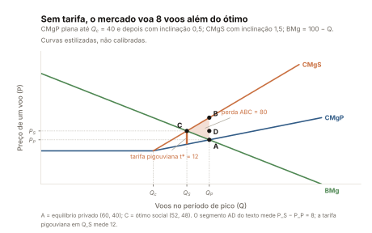
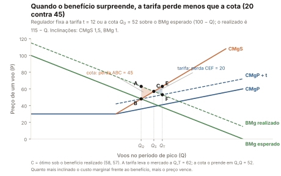
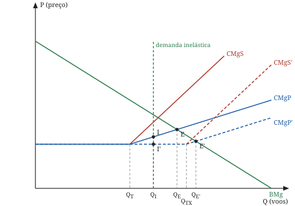
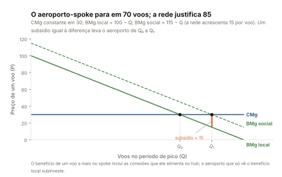
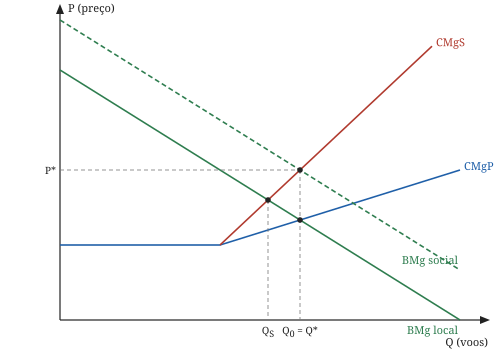

# A economia do congestionamento aeroportuário — a revisão de 2013, redesenhada

Este capítulo transpõe as seções 2 ("Princípios econômicos dos atrasos em
aeroportos") e 3 ("Revisão de literatura") da monografia *Efeitos da entrada
de uma empresa aérea de baixo custo na internalização das externalidades do
congestionamento* (USP/ESALQ, Piracicaba, 2013; orientadores Márcia Azanha
Ferraz Dias de Moraes e Alessandro Vinícius Marques de Oliveira; depósito no
Zenodo em curso: `[DOI-MONOGRAFIA]`), mais os parágrafos sobre baixo custo
da seção 4.5. Não é paráfrase: a voz é didática e as figuras, redesenhadas
por `theory/figures.py`. Nada aqui é estimado — todo número em prosa é
coordenada de `reports/theory/figures.json` ou número externo citado pela
monografia. Ordem de leitura: este é o capítulo 1 de 4; o capítulo 2
(`docs/theory/02-o-jogo-do-congestionamento.md`) deriva o jogo de
Stackelberg da seção 4, com a álgebra em `theory/model.py` e
`reports/theory/model.json`; o capítulo 3 chega ao artigo de 2016
(*Transportation Research Part A* 85, 39–52) e o capítulo 4, à sua recepção.

## 1. Congestionamento como externalidade negativa

Um voo a mais em um aeroporto cheio atrasa os outros. Quem o programa paga
combustível, tripulação e tarifa de pouso — não o atraso alheio, que fica
com terceiros:

> os custos sociais (ou seja, os custos privados mais os custos forçados a
> terceiros) excedem os custos privados.
>
> (monografia, seção 2.1)

Com $Q$ o número de voos programados no período de pico:

$$
\mathrm{CMgS}(Q) \;=\; \mathrm{CMgP}(Q) \;+\; c(Q)
$$

onde $\mathrm{CMgP}$ é o custo marginal privado, $\mathrm{CMgS}$ o social e
$c(Q)$ o custo do congestionamento — a fatia imposta a terceiros. Todo o
resto decorre de $c(Q) > 0$ acima de certo tráfego. A monografia mede o
problema com dois números da Agência Nacional de Aviação Civil: 33,6% dos
voos atrasados em 2007 e 12,9% em 2012 (monografia, introdução — documento
externo), nenhum recalculado aqui.

## 2. O nível eficiente de congestionamento (Figura 1)



Redesenhada por `theory/figures.py` a partir de curvas paramétricas;
adaptada de Cohen e Coughlin (2003) / Cohen, Coughlin e Ott (2009), não
copiada. Coordenadas em `reports/theory/figures.json`.

O custo marginal privado $\mathrm{CMgP}$ é plano enquanto o aeroporto está
folgado e sobe a partir do limiar $Q_c = 40$
(`figures.fig1.quantities.Q_c`); o custo marginal social $\mathrm{CMgS}$
soma a ele o atraso imposto às demais, coincidindo com $\mathrm{CMgP}$
abaixo de $Q_c$ e descolando acima; o benefício marginal $\mathrm{BMg}$
decresce. Acima de $Q_c$ as inclinações de $\mathrm{CMgP}$ e $\mathrm{CMgS}$
são 0,5 e 1,5, e a de $\mathrm{BMg}$ é $-1$ (`figures.fig1.curves`). A
empresa programa até $\mathrm{BMg} = \mathrm{CMgP}$: $Q_P = 60$
(`figures.fig1.quantities.Q_P`) ao preço $P_P = 40$
(`figures.fig1.quantities.P_P`), o ponto A. O ótimo social está em
$\mathrm{BMg} = \mathrm{CMgS}$: $Q_S = 52$ (`figures.fig1.quantities.Q_S`)
ao preço $P_S = 48$ (`figures.fig1.quantities.P_S`), o ponto C. B é o custo
social em $Q_P$; D, a projeção de $P_S$ sobre a vertical de $Q_P$. Repare no
que a figura **não** diz:

> o nível eficiente de congestionamento não é zero, mas sim uma certa
> quantidade positiva.
>
> (monografia, seção 2.2)

Entre $Q_c$ e $Q_S$ há fila, e ela compensa. O desperdício, entre $Q_S$ e
$Q_P$, é o triângulo ABC, de área 80
(`figures.fig1.quantities.triangle_ABC_area`). **Dois remédios.** Preço: uma
tarifa por voo, maior no pico, que empurre demanda para os horários
folgados. Quantidade: limitar pousos e decolagens por janela de tempo — o
conceito de slot — fixando a oferta em $Q_S$. A quantidade traz uma pergunta
que o preço não traz: quem fica com os slots. O direito adquirido
(*grandfathering*) protege o incumbente e pode deixar horários valiosos com
quem menos os valoriza; o leilão, com revenda secundária, induz lances que
revelam o valor verdadeiro e deixa a receita com o poder público — a
"captura de valor" da monografia (seção 2.2), que poderia financiar
aeroportos menos eficientes. As datas em que aeroportos brasileiros passaram
a ter horários coordenados estão em `data/external/slots.csv` (observação
deste repositório). **Um cuidado com a tarifa:** a monografia diz que a
tarifa que leva de $Q_P$ a $Q_S$ é "AD (ou a diferença entre $P_S$ e
$P_P$)". No redesenho esse segmento mede 8
(`figures.fig1.quantities.toll_AD_equals_PS_minus_PP`), enquanto a tarifa
pigouviana $t^{*} = \mathrm{CMgS}(Q_S) - \mathrm{CMgP}(Q_S)$ mede 12
(`figures.fig1.quantities.toll_pigou_at_QS`). Coincidem só com
$\mathrm{CMgP}$ plano entre $Q_S$ e $Q_P$; já inclinado ali, $P_S - P_P$
subestima o necessário (observação deste repositório; volta na seção 9).

## 3. Preço ou quantidade sob incerteza (Figura 2)

A seção anterior supõe o regulador onisciente. A Figura 2 mantém os custos
conhecidos e retira o conhecimento dos benefícios: ele age sobre um
benefício marginal esperado, $\mathrm{BMgE}$, e o mundo entrega um
realizado, $\mathrm{BMgR}$, mais alto.



Redesenhada por `theory/figures.py` a partir de curvas paramétricas;
adaptada de Cohen e Coughlin (2003) / Cohen, Coughlin e Ott (2009), não
copiada. Coordenadas em `reports/theory/figures.json`.

Calibrado na expectativa, o regulador escolhe uma tarifa por voo de 12
(`figures.fig2.quantities.toll_set_on_expectations`) ou uma cota de 52 voos
(`figures.fig2.quantities.Q_Q_quota`). Sob a tarifa a empresa vê
$\mathrm{CMgP}$ deslocada para cima e programa 62 voos
(`figures.fig2.quantities.Q_T_under_the_toll`), voos demais; sob a cota fica
presa em 52, voos de menos. O eficiente seria 58
(`figures.fig2.quantities.Q_S_efficient_under_BMgR`) ao preço 57
(`figures.fig2.quantities.P_S`), o ponto C. Cada erro tem seu triângulo: o
da quantidade é ABC, de área 45
(`figures.fig2.quantities.triangle_ABC_area_quantity_regulation`); o do
preço é CEF, de área 20
(`figures.fig2.quantities.triangle_CEF_area_price_regulation`).

> Conforme a Figura 2, a área do triângulo CEF é menor que a área do
> triângulo ABC. Portanto, a regulação via preços seria preferível à de
> quantidade.
>
> (monografia, seção 2.3)

Não é acaso: o custo marginal social é mais inclinado (1,5) que o benefício
marginal (1), conforme `figures.fig2.note`. A regra geral tem nome — regra
de Weitzman (1974): benefício marginal mais inclinado favorece quantidade,
mais plano favorece preço. A monografia chega lá pela geometria, sem citá-lo
(observação deste repositório). Quatro desdobramentos, da seção 2.3.
**Incerteza de custo:** se a dúvida estiver em $\mathrm{CMgS}$ e não em
$\mathrm{BMg}$, preço e quantidade dão resultados idênticos. **Tarifas por
empresa:** a empresa grande já sofre parte da fila que provoca, e com duas
empresas a maior paga tarifa **menor** que a menor — obtido formalmente no
capítulo 2, seção 5. **Quantidade com negociação:** slots distribuídos de
graça e negociados entre as empresas chegam ao resultado eficiente se os
custos de transação forem baixos — argumento coasiano que defende o
*grandfathering* quanto à eficiência, nunca quanto à entrada. **Aeroportos
não são ilhas:** vizinhos são substitutos por passageiros e complementares
pela rede, e Czerny (2006) mostra que sob tarifa a incerteza de demanda se
propaga entre aeroportos, enquanto a restrição de slots a interrompe — o
único argumento a favor da quantidade.

## 4. Expandir o aeroporto (Figura 3)

Tarifa e slot movem a demanda ao longo das curvas; expandir desloca
$\mathrm{CMgP}$ e $\mathrm{CMgS}$ para a direita e empurra o limiar de
congestionamento.



Redesenhada por `theory/figures.py` a partir de curvas paramétricas;
adaptada de Cohen e Coughlin (2003) / Cohen, Coughlin e Ott (2009), não
copiada. Coordenadas em `reports/theory/figures.json`.

O limiar sai de $Q_T = 40$ (`figures.fig3.quantities.Q_T`) para
$Q_{TX} = 64$ (`figures.fig3.quantities.Q_TX`), e o que decide é quem
responde. Com demanda elástica o equilíbrio migra de 60
(`figures.fig3.quantities.Q_E_before`) para 68
(`figures.fig3.quantities.Q_E_after`), acima do novo limiar, e o
congestionamento sobrevive à obra; com demanda inelástica fica em 50
(`figures.fig3.quantities.Q_I`), abaixo do limiar, e o preço cai de 35
(`figures.fig3.quantities.P_I_before`) para 30
(`figures.fig3.quantities.P_I_after`), com a fila desaparecendo: capacidade
nova compra mais viagem, não menos fila. Resta o que a comparação esconde:
se a expansão vale o que custa, contra três benefícios — congestionamento
evitado, viagens novas e economia operacional. `data/external/capacity.csv`
guarda capacidade horária declarada, o limiar $Q_T$ em movimentos por hora;
`DECISIONS.md` ADR-0007 registra que a variável de congestionamento usa hoje
uma proxy interna, pois as declarações sazonais da ANAC não foram coletadas.

## 5. Externalidades de rede (Figuras 4 e 5)

Até aqui, um aeroporto sozinho. O sistema é uma rede *hub-and-spoke*: quem
embarca em um *spoke* beneficia quem conecta no *hub*, e isso não entra na
conta do planejador local.



Redesenhada por `theory/figures.py` a partir de curvas paramétricas;
adaptada de Cohen e Coughlin (2003) / Cohen, Coughlin e Ott (2009), não
copiada. Coordenadas em `reports/theory/figures.json`.

O planejador que iguala benefício marginal **local** ao custo marginal para
em $Q_0 = 70$ (`figures.fig4.quantities.Q_0`); o benefício marginal
**social**, que inclui a rede, está acima, e o volume eficiente é $Q_1 = 85$
(`figures.fig4.quantities.Q_1`). A distância entre as curvas, 15
(`figures.fig4.quantities.subsidy_at_Q_1`), é o subsídio (ou transferência
intergovernamental) que leva de $Q_0$ a $Q_1$ — a tarifa da seção 2 com o
sinal trocado.



Redesenhada por `theory/figures.py` a partir de curvas paramétricas;
adaptada de Cohen e Coughlin (2003) / Cohen, Coughlin e Ott (2009), não
copiada. Coordenadas em `reports/theory/figures.json`.

Juntas, as duas externalidades apontam para lados opostos. A Figura 5 é
desenhada como a monografia descreve a dela, com os efeitos calibrados para
se cancelarem: o mercado sozinho para em $Q_0 = 60$
(`figures.fig5.quantities.Q_0`); corrigindo só o congestionamento cairia
para 52 (`figures.fig5.quantities.Q_S_congestion_only`), corrigindo só a
rede subiria para cerca de 73,3
(`figures.fig5.quantities.Q_N_network_only`). Corrigindo as duas,
$\mathrm{BMgS}(Q^{*}) = \mathrm{CMgS}(Q^{*})$ devolve $Q^{*} = 60$
(`figures.fig5.quantities.Q_star`) ao preço 60
(`figures.fig5.quantities.P_star`) — o próprio volume de mercado, o que a
chave `figures.fig5.quantities.Q_star_equals_Q_0` registra como verdadeiro.
A política ótima, aqui, é não fazer nada — e a monografia não vende isso
como geral:

> quando representados os dois tipos de externalidades, a prescrição
> política é ambígua, a menos que se saibam os tamanhos dos efeitos.
>
> (monografia, seção 2.4)

Se o congestionamento pesa mais, cabe tarifa; se a rede pesa mais, subsídio;
se empatam, silêncio. Qual é o caso é pergunta empírica — a do artigo de
2016.

## 6. A literatura da internalização, em ordem

A demanda cresce mais rápido que a capacidade dos aeroportos (Czerny e Zhang
2011), e a resposta óbvia é elevar a tarifa até o nível eficiente da Figura 1
— mas identificá-lo esbarra em três dificuldades do setor: a **estrutura
vertical** (aeroportos a montante, empresas a jusante); o **oligopólio**; e
a **heterogeneidade dos passageiros**, pois quem viaja a negócios valoriza
mais o tempo. O ponto de discórdia é a **internalização**: a empresa grande,
que sofre parte da fila que provoca, já embute esse custo nas passagens? Se
sim, a tarifa eficiente pode cair abaixo do nível atomístico — o de empresas
sem poder de mercado, com todo atraso tratado como externo.

**Daniel (1995)** concluiu pela negativa: se a dominante corta voos,
concorrentes sem barreiras ocupam a lacuna e o incentivo evapora. **Daniel e
Harback (2008)** testam a hipótese, rejeitam-na e propõem tratar todos os
atrasos como externos. **Morrison e Winston (2007)** ficam no meio: só parte
dos atrasos é internalizada. Do outro lado, uma linhagem larga. **Brueckner
(2002)** estende ao aéreo o modelo do transporte de superfície: o
monopolista discriminador internaliza integralmente e, sob Cournot, cada
empresa internaliza só o congestionamento próprio — resposta que, como
observa Oliveira (2012), é elucidativa sobre o papel do regulador; **Pels e
Verhoef (2004)** replicam o resultado. Para **Mayer e Sinai (2003)** o
efeito hub domina empiricamente, porque as empresas concentram voos na mesma
janela para maximizar conexões. **Zhang e Zhang (2006)** ligam
internalização a capacidade: internalizando, a tarifa cobrável é limitada, e
com ela os recursos para investir. **Basso e Zhang (2008)** mostram que o
aeroporto privado cobra mais e reduz bem-estar — menos congestionamento não
é, por si, melhor. **Brueckner e Van Dender (2008)** amarram as duas visões
e trocam a pergunta: o que decide não é a concentração, é a **estrutura** de
mercado — número de vendedores e compradores, diferenciação de produto,
barreiras à entrada, estrutura de custos, integração vertical,
diversificação. Sob Cournot internaliza-se e a tarifa cai; o líder de
Stackelberg diante de uma franja não tem esse incentivo — síntese que o
capítulo 2 deriva. **Ater (2012)** acrescenta que empresas em aeroportos
concentrados espaçam mais seus horários conforme a participação cresce, o
que reduz atrasos e limita o efeito de uma tarifa. **Czerny e Zhang (2011)**
trazem o passageiro: pode valer elevar a taxa para proteger quem tem alto
valor do tempo, efeito capaz de dominar o de mercado. **Rupp (2009)** é
citado no corpo da monografia entre os que encontram internalização, mas não
tem entrada na bibliografia; fica como citado e não verificado.

| obra | estrutura de mercado | quem internaliza | tarifa eficiente relativa à atomística |
|---|---|---|---|
| Daniel (1995) | dominante diante de franja com entrada livre | ninguém, na prática | igual à atomística |
| Daniel e Harback (2008) | dominante com franja, teste empírico | hipótese rejeitada nos dados | igual à atomística, com todo atraso tratado como externo |
| Morrison e Winston (2007) | oligopólio com dominância | parcialmente, as dominantes | abaixo da atomística, sem chegar a zero |
| Brueckner (2002) | monopólio discriminador e oligopólio Cournot | integralmente no monopólio, só o próprio sob Cournot | nula no monopólio, reduzida sob Cournot |
| Pels e Verhoef (2004) | oligopólio Cournot | só o congestionamento próprio | reduzida, na proporção da participação |
| Mayer e Sinai (2003) | hubs de rede | o efeito de rede domina o de congestionamento | pequena, com pouco efeito sobre a grade de voos |
| Zhang e Zhang (2006) | oligopólio com poder de mercado e aeroporto investidor | a própria empresa, o que limita a tarifa cobrável | reduzida, ao custo do financiamento da capacidade |
| Basso e Zhang (2008) | aeroporto público comparado ao privado | a questão é o dono do aeroporto, não a aérea | mais alta sob aeroporto privado, com perda de bem-estar |
| Brueckner e Van Dender (2008) | Cournot comparado a líder de Stackelberg com franja | sob Cournot sim, sob liderança não | baixa sob Cournot, próxima da atomística sob liderança |
| Ater (2012) | aeroportos concentrados | as dominantes, via espaçamento dos horários | positiva apenas nos picos de custo de fila |
| Czerny e Zhang (2011) | passageiros heterogêneos, aéreas não-atomísticas | as aéreas, mas o efeito passageiro domina | acima do que o poder de mercado sozinho justificaria |

## 7. O modelo de negócios de baixo custo

A seção 4.5 sai da regulação e entra na firma. O modelo de baixo custo —
"sem supérfluos" na Europa, porque a empresa oferece apenas o serviço básico
— produziu vocabulário próprio: o **efeito Southwest** é a queda de tarifas
quando uma empresa desse tipo passa a servir um aeroporto que não tinha
nenhuma. Não há definição única, mas há consenso sobre o método: tarifas
baixas por estratégias que ora removem elementos da função de produção, ora
reduzem os que restam — cobrar serviços a bordo, encurtar o tempo de escala,
cortar comissões de venda, negociar duro as taxas com aeroportos e
fornecedores.

O preço menor gera tráfego novo mais do que o transfere: o volume das
incumbentes muda pouco, mas o resultado financeiro piora. Button (2012)
descreve a mudança estrutural — tarifas caindo, demanda crescendo,
tradicionais perdendo participação. **Dresner, Lin e Windle (1996)**
argumentam que o efeito é maior do que se estimava, pelos transbordamentos
do serviço da Southwest sobre rotas concorrentes adjacentes. **Morrison
(2001)** mede a concorrência potencial trazida pela Southwest nas rotas
norte-americanas de 1998: os passageiros da própria Southwest ganharam 3,4
bilhões de dólares e os das demais operadoras, 9,5 bilhões de dólares, a
preços correntes (monografia, seção 4.5 — documento externo). O modelo mexeu
também com os aeroportos: para manter custos baixos, essas empresas usam
aeroportos pequenos, secundários ou terciários, ou terminais dedicados nos
principais — concorrência fora do ambiente regulado. **Francis, Fidato e
Humphreys (2003)** questionam a sustentabilidade do arranjo: o sucesso de
muitas veio do crescimento rápido de passageiros nos aeroportos onde operam,
mas muitas fracassaram, e contratos que reflitam o risco de fracasso ficam
mais difíceis à medida que entrantes proliferam.

**Duas estratégias, dois casos brasileiros.** Uma entrante pode criar
mercado novo ou disputar mercado existente. A **Azul** seguiu a primeira,
com aeroportos secundários ou regionais como alvo — o aeroporto secundário e
dominado a que ela se refere é Viracopos, em Campinas, que a seção 4.5 não
nomeia (observação deste repositório). A **Gol**, entre 2001 e 2005, seguiu
a segunda: mercados grandes já disputados, com preços competitivos. Oliveira
(2009) divide seus primeiros anos em duas fases. Na de "baixo custo, tarifa
baixa" o crescimento foi exponencial, puxado por preços menores, publicidade
agressiva, estímulo de demanda, a saída da Transbrasil e o acesso a
Congonhas no primeiro ano e a Santos Dumont e à Ponte Aérea Rio de
Janeiro–São Paulo no segundo. Na fase seguinte, apenas de "baixo custo", o
crescimento arrefeceu — porém seguiu constante — sob a queda dos preços da
concorrência, a desvalorização cambial de 2002, o *code share* Varig-TAM de
2003 e a re-regulação do Departamento de Aviação Civil, com congelamento de
oferta em 2003 e restrições à precificação agressiva em 2004. Ao fundo está
a desregulamentação do mercado aéreo nacional a partir de 2000, que permitiu
tarifas menores ao aumentar a concorrência. Seja qual for a estratégia, a
tarifa baixa é a vantagem competitiva, e pesa mais onde há concorrentes.
Este é o terreno verbal da **Pressuposição 3** — a hipótese de que a entrada
de uma empresa de baixo custo quebra o jogo de Stackelberg e de que tal
empresa tem motivo próprio para internalizar o congestionamento —, enunciada
e derivada no capítulo 2.

## 8. O que é da monografia e o que é dos originais

**A seção 2 é exposição.** Reapresenta, em português, o argumento de dois
artigos do Federal Reserve, e as legendas dizem isso: a Figura 1 é
"elaborado pelo autor com base em Cohen, Coughlin e Ott (2009)", a Figura 2
credita os mesmos autores e as Figuras 3, 4 e 5 creditam Cohen e Coughlin
(2003). As figuras aqui são redesenhos paramétricos, não reproduções. **A
seção 3 é revisão**, sem tese própria; sua contribuição é organizar o debate
entre a linhagem de Daniel e a de Brueckner. **A contribuição original vem
depois:** o modelo de líder de Stackelberg e a estimação por efeitos fixos
ponderada — capítulos 2 e 3 — são o trabalho novo; este capítulo é a
fundação verbal deles.

## 9. Limites declarados

- **As figuras são estilizadas.** Curvas lineares por partes com parâmetros
  escolhidos aqui; nada foi calibrado a dado brasileiro. As áreas e tarifas
  das seções 2 a 5 são propriedades do desenho, não do mundo.
- **A revisão para em 2012, por desenho.** A seção 3 é de 2013; a única obra
  posterior discutida na série é Guo, Jiang e Wan (2018), no capítulo 2,
  seção 9.
- **Os percentuais da ANAC são externos.** 33,6% em 2007 e 12,9% em 2012
  (monografia, introdução — documento externo) não foram recalculados aqui e
  não devem ser comparados a números da replicação sem verificar definição e
  universo.
- **A tarifa "AD" da Figura 1 merece confirmação do autor.** O texto iguala
  a tarifa à diferença $P_S - P_P$; no redesenho esse segmento mede 8
  (`figures.fig1.quantities.toll_AD_equals_PS_minus_PP`) contra 12 da tarifa
  pigouviana em $Q_S$ (`figures.fig1.quantities.toll_pigou_at_QS`). Anotado,
  não resolvido.
- **A frase sobre inclinações da Figura 2 parece invertida:**

  > No entanto, se a inclinação da curva de benefício marginal realizado
  > tornar-se mais plana em relação à curva de custo marginal social, a
  > regulação pela quantidade será provavelmente a abordagem preferida.
  >
  > (monografia, seção 2.3)

  Pela regra padrão, benefício marginal mais plano favorece o preço — e é o
  que a própria Figura 2 mostra, com CEF menor que ABC. Frase e figura
  apontam para lados opostos; fica como ponto a confirmar com o autor.

## 10. Como reproduzir

```bash
just theory
```

O comando reescreve os cinco SVG e o `reports/theory/figures.json` de forma
determinística e offline, e uma segunda execução sobre a árvore inalterada
não muda nada. Para ver $Q_S$ se deslocar, altere uma inclinação em
`theory/figures.py` localmente, sem versionar a alteração.

Referências completas em [bibliografia.md](bibliografia.md).
