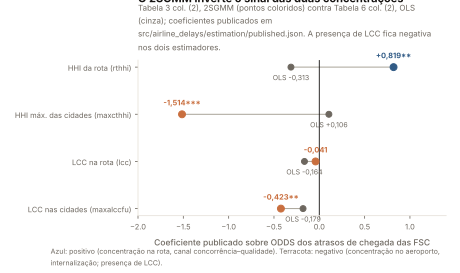

# The theory layer - results

Generated by `airline-delays theory` from `airline_delays.theory`. Source: Bendinelli (2013), undergraduate monograph, USP, section 4, following Brueckner and Van Dender (2008, Journal of Urban Economics 64, 288-295) and Brueckner (2002, American Economic Review 92, 1357-1375); figures after Cohen and Coughlin (2003) and Cohen, Coughlin and Ott (2009), redrawn. No number below is typed by hand; the Portuguese chapters under `docs/study/` quote this file's inputs (`model.json`, `figures.json`) by key.

## 1. Identities

29 algebraic statements, each checked with sympy 1.14.0. `origin` says whose statement it is: the monograph's, Brueckner and Van Dender's (BVD), Brueckner (2002)'s, or this repository's (`here`).

| id | equation | origin | holds | statement |
|---|---|---|---|---|
| `eq6_social_foc` | (6) | monograph | yes | The efficient condition is p - tau - [F c'(F) + c(F)]/s = 0 |
| `eq7_follower_foc` | (7) | monograph | yes | The follower's condition is p - tau - [f2 c' + c]/s = 0 |
| `eq8_reaction_slope` | (8) | monograph | yes | df2/df1 = -(f2 c'' + c')/(f2 c'' + 2 c') |
| `eq8_lambda_of_x` | (8) | here | yes | lambda = (1 + x)/(2 + x) with x = f2 c''/c' |
| `eq8_lambda_minus_half` | (8) | monograph | yes | lambda - 1/2 = x/(2(2 + x)) >= 0, so lambda >= 1/2 |
| `eq8_one_minus_lambda` | (8) | monograph | yes | 1 - lambda = 1/(2 + x) > 0, so lambda < 1 |
| `eq8_lambda_half_when_linear` | (8) | monograph | yes | lambda = 1/2 exactly when c'' = 0 |
| `eq9_leader_foc` | (9) | monograph | yes | The leader's condition is p - tau - (1/s)[f1 c'(1 + df2/df1) + c] = 0 |
| `f1_over_f2` | (7),(9) | here | yes | At one point (7) and (9) give f1 = f2/(1 - lambda); with lambda = (1+x)/(2+x), f1 - 2 f2 = f2 x >= 0 |
| `eq10_gap` | (10) | monograph | yes | F c' - f1 c'(1 - lambda) = (f2 + lambda f1) c' |
| `eq10_two_forms` | (10) | monograph | yes | (f2 - f1 df2/df1) c' = (f2 + lambda f1) MCD/(f1 + f2) when df2/df1 = -lambda |
| `eq11_symmetric` | (11) | BVD | yes | At f1 = f2 = f*: T1* = (1/2)(1 + lambda*) MCD* |
| `eq11_linear_3_4` | (11) | here | yes | With c'' = 0 (lambda* = 1/2) the leader's toll is 3/4 of MCD*, halfway between the Cournot toll (1/2) and the atomistic toll (1) |
| `eq11_follower_half` | (11) | BVD | yes | The follower's toll F c' - f2 c' = f1 c' is 1/2 MCD* at the symmetric optimum |
| `monopoly_foc_is_social` | benchmark | Brueckner (2002) | yes | A monopolist's condition coincides with the efficient one (full internalisation) |
| `cournot_toll_half_at_symmetry` | benchmark | Brueckner (2002) | yes | A Cournot duopolist's toll is the rival's flights times c', i.e. 1/2 MCD at symmetry |
| `eq12_leader_foc` | (12) | monograph | yes | With p = d(sF): d + s f1 d'(1 + df2/df1) - tau - (1/s)[f1 c'(1 + df2/df1) + c] = 0 |
| `eq12_social_foc` | (12) | monograph | yes | The efficient condition under inelastic demand is d - tau - [F c' + c]/s = 0 |
| `eq12_limit_minus_1` | (12) | monograph | yes | At df2/df1 = -1 the condition collapses to d - tau - c/s = 0 |
| `eq12_limit_minus_half` | (12) | monograph | yes | At df2/df1 = -1/2: d + s f1 d'/2 - tau - (f1 c'/2 + c)/s = 0 |
| `lambda_inelastic_general` | (12) | here | yes | Under p = d(sF), df2/df1 = -A_/B_ with B_ = A_ + c'/s - s d'; and -df2/df1 - 1/2 = f2 (c''/s - s^2 d'')/(2 B_), so the bound <= -1/2 holds iff c''/s >= s^2 d'' |
| `lambda_linear_demand` | (12) | here | yes | With d'' = 0: df2/df1 = -(k + f2 c'')/(2k + f2 c''), k = c' - s^2 d' > 0, so the elastic-case bounds hold |
| `linear_F_star` | linear | here | yes | c = a + bF: the efficient total is D/(2b) |
| `linear_cournot` | linear | here | yes | c = a + bF: each Cournot duopolist flies D/(3b) |
| `linear_stackelberg` | linear | here | yes | c = a + bF: the leader flies D/(2b) and the follower D/(4b) |
| `linear_atomistic` | linear | here | yes | c = a + bF: price-taking airlines fly D/b in total, twice the efficient total |
| `linear_welfare_losses` | linear | here | yes | c = a + bF: the welfare loss is 1/9 of W* under Cournot, 1/4 under Stackelberg and all of it under atomistic behaviour |
| `inelastic_linear_closed_forms` | (12) linear | here | yes | c = a + bF, d = d0 - dd Q: f1 = Dp/(2m), f2 = Dp/(4m), F* = Dp/(s^2 dd + 2b) |
| `T1_equals_T2_at_stackelberg` | (10) | here | yes | At any Stackelberg equilibrium f2 = (1 - lambda) f1, so T1 = T2 = f1 c' |

## 2. The follower's reaction and the leader's advantage

- Equation (8): `df2/df1 = (-c1 - c2*f2)/(2*c1 + c2*f2)`; with `x = f2 c''/c'`, `lambda = (x + 1)/(x + 2)`.
- `lambda - 1/2 = x/(2*x + 4)` and `1 - lambda = 1/(x + 2)`, so `0.5 <= lambda < 1`; `lambda = 0.5` under linear cost.
- `[here]` f1 = f2/(1 - lambda) >= 2 f2; equality under linear cost (`f1 = -f2/(lambda - 1)`).

## 3. Proposition 1: the tolls at the symmetric optimum, as shares of MCD*

| structure | toll / MCD* |
|---|---|
| monopoly | 0 |
| Cournot duopolist, and the Stackelberg follower | 0.5000 |
| Stackelberg leader | `lambda/2 + 1/2`; 0.7500 (= 3/4) under linear cost |
| atomistic | 1 |

`MCD = (f1 + f2) c'`; `T1 = c1*(-f1*slope + f2) = c1*(f1*lambda + f2)`; `T2 = c1*f1`.

## 4. Numeric examples

### linear

Primitives p = 300, tau = 200, s = 100; cost linear (a = 1,000, b = 100); demand perfectly elastic.

| quantity | value |
|---|---|
| F* (efficient total), W* | 45, 202,500 |
| lambda*, T1*/MCD*, T1*, T2* | 0.5000, 0.7500, 3,375, 2,250 |
| Stackelberg f1, f2, F | 45, 22.5000, 67.5000 |
| Stackelberg lambda, f1/f2, T1/MCD, T1, T2 | 0.5000, 2, 0.6667, 4,500, 4,500 |
| Stackelberg profits, welfare, loss share | 101,250, 50,625, 151,875, 0.2500 |
| Cournot f, F, loss share | 30, 60, 0.1111 |
| atomistic F, loss share | 90, 1 |
| monopoly F | 45 |

### quadratic

Primitives p = 300, tau = 200, s = 100; cost quadratic (a = 1,000, b = 50, q = 1); demand perfectly elastic.

| quantity | value |
|---|---|
| F* (efficient total), W* | 40.5852, 216,058.6216 |
| lambda*, T1*/MCD*, T1*, T2* | 0.5670, 0.7835, 4,170.9945, 2,661.7899 |
| Stackelberg f1, f2, F | 39.2613, 17.7163, 56.9776 |
| Stackelberg lambda, f1/f2, T1/MCD, T1, T2 | 0.5488, 2.2161, 0.6891, 6,437.0890, 6,437.0890 |
| Stackelberg profits, welfare, loss share | 114,041.3555, 51,460.1172, 165,501.4727, 0.2340 |
| Cournot f, F, loss share | 25.4516, 50.9032, 0.0897 |
| atomistic F, loss share | 73.1071, 1 |
| monopoly F | 40.5852 |

### inelastic_linear_demand

Primitives p = 300, tau = 200, s = 100; cost linear (a = 1,000, b = 100); demand d0 = 400, dd = 0.0150.

| quantity | value |
|---|---|
| F* (efficient total), W* | 54.2857, 515,714.2857 |
| lambda*, T1*/MCD*, T1*, T2* | 0.5000, 0.7500, 4,071.4286, 2,714.2857 |
| Stackelberg f1, f2, F | 38, 19, 57 |
| Stackelberg lambda, f1/f2, T1/MCD, T1, T2 | 0.5000, 2, 0.6667, 3,800, 3,800 |
| Stackelberg profits, welfare, loss share | 180,500, 90,250, 514,425, 0.0025 |
| Cournot f, F, loss share | 25.3333, 50.6667, 0.0044 |
| atomistic F, loss share | 76, 0.1600 |
| monopoly F | 38 |
| equation (12) at the Stackelberg point: market-power term, uninternalised term, atomistic toll per seat | -28.5000, 19, 57 |

## 5. Comparative statics `[here]`

Cost curvature `q` in `c = 1000 + 50 F + q F^2`, perfectly elastic demand:

| q | F* | lambda* | T1*/MCD* | Stackelberg lambda | f1/f2 | T1/MCD | loss share |
|---|---|---|---|---|---|---|---|
| 0 | 90 | 0.5000 | 0.7500 | 0.5000 | 2 | 0.6667 | 0.2500 |
| 0.2500 | 61.5692 | 0.5435 | 0.7717 | 0.5346 | 2.1489 | 0.6824 | 0.2394 |
| 0.5000 | 50.9941 | 0.5560 | 0.7780 | 0.5424 | 2.1856 | 0.6861 | 0.2365 |
| 1 | 40.5852 | 0.5670 | 0.7835 | 0.5488 | 2.2161 | 0.6891 | 0.2340 |
| 2 | 31.2829 | 0.5758 | 0.7879 | 0.5535 | 2.2399 | 0.6913 | 0.2320 |
| 4 | 23.5346 | 0.5825 | 0.7912 | 0.5571 | 2.2576 | 0.6930 | 0.2305 |

Demand slope `dd` in `d(Q) = 400 - dd Q`, linear cost `1000 + 100 F` (`dd = 0` is the perfectly elastic case):

| dd | f1 | f2 | F | F* | price | market-power term | uninternalised term | loss share |
|---|---|---|---|---|---|---|---|---|
| 0 | 45 | 22.5000 | 67.5000 | 45 | 300 | 0 | 22.5000 | 0.2500 |
| 0.0050 | 63.3333 | 31.6667 | 95 | 76 | 352.5000 | -15.8333 | 31.6667 | 0.0625 |
| 0.0150 | 38 | 19 | 57 | 54.2857 | 314.5000 | -28.5000 | 19 | 0.0025 |
| 0.0300 | 23.7500 | 11.8750 | 35.6250 | 38 | 293.1250 | -35.6250 | 11.8750 | 0.0039 |

## 6. Extension of this repository: a low-cost entrant in a Cournot game

Extension of this repository, not of the monograph. Two incumbents at tau = 200 and an entrant at tau = 170, linear cost.

| quantity | value |
|---|---|
| total flights F | 75 (Cournot duopoly of incumbents: 60; Stackelberg duopoly: 67.5000) |
| flights: entrant, incumbents | 45, 15, 15 |
| internalised share of MCD: entrant, incumbents | 0.6000, 0.2000, 0.2000 |

## 7. Bridge to the 2016 article (published signs, Table 3 column 2 and Table 6 column 2)

| variable | theory object | expected | Table 3 (2): b, stars | Table 6 (2): b, stars | pattern over the six columns of Table 3 |
|---|---|---|---|---|---|
| `dailyflcong` | flight volumes in the congested (peak) period: f1 + f2 with c' > 0 | + | 0.0043 * | 0.0016  | +6 / -0 / absent 0 |
| `dailyflncong` | flight volumes off peak: the period where the model puts no congestion | + | 0.0044 ** | 0.0014  | +6 / -0 / absent 0 |
| `prwheather` | non-strategic delay: weather and airport restrictions | + | 4.7145 *** | 4.7385 *** | +6 / -0 / absent 0 |
| `princident` | non-strategic delay: incidents | + | 6.1807 *** | 6.3062 *** | +6 / -0 / absent 0 |
| `pr_connc` | non-strategic delay: aircraft rotation (code RA) | + | 2.4781 *** | 2.3032 *** | +6 / -0 / absent 0 |
| `maxprdel` | the airport's congestion state: delays of all carriers at the busier endpoint | + | 1.5460 *** | 1.6945 *** | +6 / -0 / absent 0 |
| `cshare` | cooperation outside the model | - | 0.0081  | 0.0132  | +6 / -0 / absent 0 |
| `rthhi` | market power on the route: d' < 0 in equation (12) | - | 0.8192 ** | -0.3126 *** | +6 / -0 / absent 0 |
| `maxcthhi` | internalisation at the airport: the dominant carrier's own share of MCD, Proposition 1 | - | -1.5144 *** | 0.1057  | +0 / -6 / absent 0 |
| `lcc` | a low-cost carrier on the route: 'Pressuposição 3' | - | -0.0412  | -0.1636 *** | +2 / -1 / absent 3 |
| `maxalccfu` | a low-cost carrier at either endpoint city: the non-price spillover | - | -0.4234 ** | -0.1793  | +0 / -3 / absent 3 |

## 8. The five figures

### Figura 1 — O nível eficiente de congestionamento

| quantity | value |
|---|---|
| Q_c | 40 |
| Q_P | 60 |
| P_P | 40 |
| Q_S | 52 |
| P_S | 48 |
| triangle_ABC_area | 80 |
| toll_AD_equals_PS_minus_PP | 8 |
| toll_pigou_at_QS | 12 |

AD = P_S - P_P is what the monograph's text says; the Pigouvian toll t* = CMgS(Q_S) - CMgP(Q_S) coincides with it only when CMgP is flat between Q_S and Q_P.

### Figura 2 — Benefício marginal em condições de incerteza

| quantity | value |
|---|---|
| toll_set_on_expectations | 12 |
| Q_Q_quota | 52 |
| Q_S_efficient_under_BMgR | 58 |
| P_S | 57 |
| Q_T_under_the_toll | 62 |
| triangle_ABC_area_quantity_regulation | 45 |
| triangle_CEF_area_price_regulation | 20 |

With these slopes (|CMgS'| = 1.5 > |BMg'| = 1) the price instrument loses less: CEF < ABC, the case the monograph's text concludes with.

### Figura 3 — Custo marginal social e privado antes e depois de uma expansão

| quantity | value |
|---|---|
| Q_T | 40 |
| Q_TX | 64 |
| Q_E_before | 60 |
| Q_E_after | 68 |
| elastic_still_congested_after | yes |
| Q_I | 50 |
| P_I_before | 35 |
| P_I_after | 30 |
| inelastic_uncongested_after | yes |

Elastic demand: the equilibrium moves from Q_E to Q_E' and stays beyond the new threshold, so congestion persists. Inelastic demand: Q_I is below the new threshold, so the expansion removes congestion.

### Figura 4 — Expansão do aeroporto levando em conta as externalidades de rede

| quantity | value |
|---|---|
| Q_0 | 70 |
| Q_1 | 85 |
| subsidy_at_Q_1 | 15 |

The spoke airport that sets flights where its local marginal benefit meets marginal cost stops at Q_0; the network-wide benefit justifies Q_1, reached with a subsidy equal to the gap between the two benefit curves.

### Figura 5 — Congestionamento e externalidades de rede

| quantity | value |
|---|---|
| Q_0 | 60 |
| Q_S_congestion_only | 52 |
| Q_N_network_only | 73.3333 |
| Q_star | 60 |
| P_star | 60 |
| Q_star_equals_Q_0 | yes |

Drawn as the monograph describes its Figure 5: the two externalities offset each other exactly, so the market quantity Q_0 is already the efficient Q* and no intervention is needed.

### Figura 6 — A função de reação da seguidora e os equilíbrios (exemplo linear)

| quantity | value |
|---|---|
| reaction_slope | -0.5000 |
| F_stackelberg | 67.5000 |
| F_cournot | 60 |
| F_star | 45 |
| F_atomistic | 90 |

Linear example of model.json; the follower's reaction is f2 = (D - b f1)/(2b).

### Figura 7 — Tarifas no ótimo simétrico por estrutura de mercado

| quantity | value |
|---|---|
| monopoly | 0 |
| cournot_and_follower | 0.5000 |
| stackelberg_leader_linear | 0.7500 |
| stackelberg_leader_quadratic | 0.7835 |
| atomistic | 1 |
| lambda_star_quadratic | 0.5670 |

Proposition 1 of Brueckner and Van Dender (2008) as numbers; the quadratic bar is where lambda* > 1/2 lifts the leader's toll above three quarters.

### Figura 8 — Estática comparativa na curvatura do custo de congestionamento

| quantity | value |
|---|---|
| q | [0.0, 0.25, 0.5, 1.0, 2.0, 4.0] |
| lambda_star | [0.5, 0.543491, 0.556041, 0.566989, 0.575777, 0.582477] |
| T1_star_over_MCD | [0.75, 0.771745, 0.778021, 0.783494, 0.787888, 0.791239] |
| f1_over_f2 | [2.0, 2.14889, 2.18555, 2.21611, 2.23987, 2.25761] |

From model.json comparative_statics.cost_curvature.

### Figura 9 — Demanda inelástica: o total de Stackelberg contra o ótimo

| quantity | value |
|---|---|
| dd | [0.0, 0.005, 0.015, 0.03] |
| F_stackelberg | [67.5, 95.0, 57.0, 35.625] |
| F_star | [45.0, 76.0, 54.2857, 38.0] |
| market_power_term | [0.0, -15.8333, -28.5, -35.625] |
| uninternalised_term | [22.5, 31.6667, 19.0, 11.875] |

From model.json comparative_statics.demand_slope.

### Figura 10 — A entrante de baixo custo e a parcela internalizada

| quantity | value |
|---|---|
| duopoly_shares | [0.5, 0.5] |
| triopoly_shares | [0.6, 0.2, 0.2] |
| F_duopoly | 60 |
| F_triopoly | 75 |

From model.json extension_lcc; labelled as this repository's extension.

### Figura 11 — OLS contra 2SGMM nos regressores de estrutura de mercado

| quantity | value |
|---|---|
| variables | ['rthhi', 'maxcthhi', 'lcc', 'maxalccfu'] |
| ols_table6_col2 | [-0.3126, 0.1057, -0.1636, -0.1793] |
| gmm_table3_col2 | [0.8192, -1.5144, -0.0412, -0.4234] |
| stars_table3_col2 | ['**', '***', '', '**'] |

Published coefficients only (src/airline_delays/estimation/published.json); nothing re-estimated.

## 9. The primer's 2 x 2 game `[here]`

Didactic games of this repository, built from examples.linear; not in the monograph. Each airline flies either f* = 22.5000 (the efficient per-firm volume) or 30 (the Cournot volume); cells are (airline 1's profit, airline 2's profit).

| no toll | airline 2 flies 22.5000 | airline 2 flies 30 |
|---|---|---|
| airline 1 flies 22.5000 | 101,250, 101,250 | 84,375, 112,500 |
| airline 1 flies 30 | 112,500, 84,375 | 90,000, 90,000 |

Dominant strategy: high; Nash cell: `high_high`.

| toll 2,250 per flight | airline 2 flies 22.5000 | airline 2 flies 30 |
|---|---|---|
| airline 1 flies 22.5000 | 50,625, 50,625 | 33,750, 45,000 |
| airline 1 flies 30 | 45,000, 33,750 | 22,500, 22,500 |

Dominant strategy: low; Nash cell: `low_low`.

Prisoner's dilemma: yes. One deviation from the cooperative cell adds 7.5000 flights, raises c by 750 per flight, gains the deviator 11,250 and costs the rival 16,875.

| f1 | follower's reaction f2 | leader's profit along the reaction |
|---|---|---|
| 0 | 45 | - |
| 22.5000 | 33.7500 | 75,937.5000 |
| 30 | 30 | 90,000 |
| 45 | 22.5000 | 101,250 |
| 60 | 15 | 90,000 |
| 90 | 0 | - |

Internalised share of MCD: monopoly 1, cournot symmetric 0.5000, stackelberg leader at equilibrium 0.3333, stackelberg follower at equilibrium 0.3333, atomistic 0.
